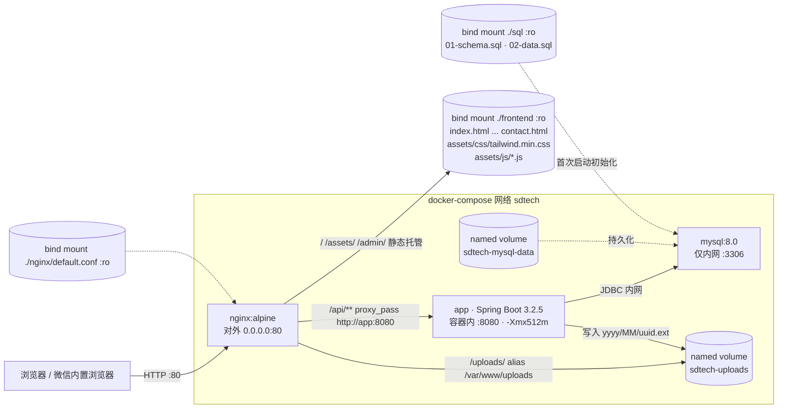
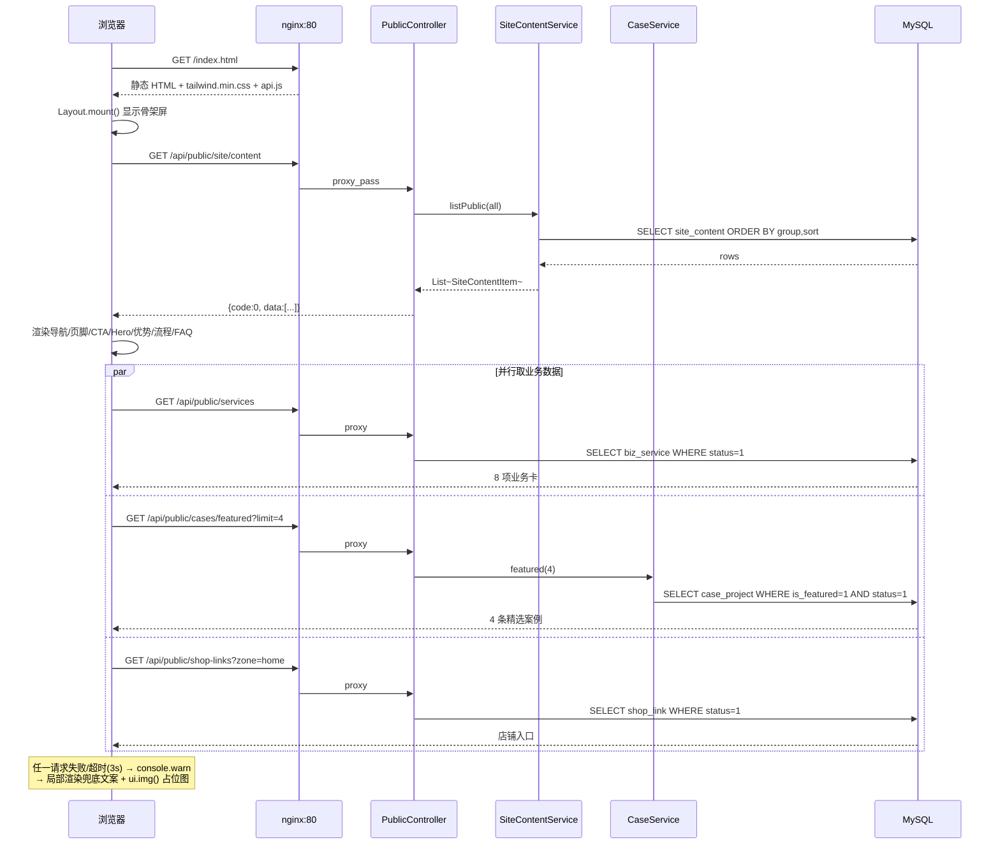
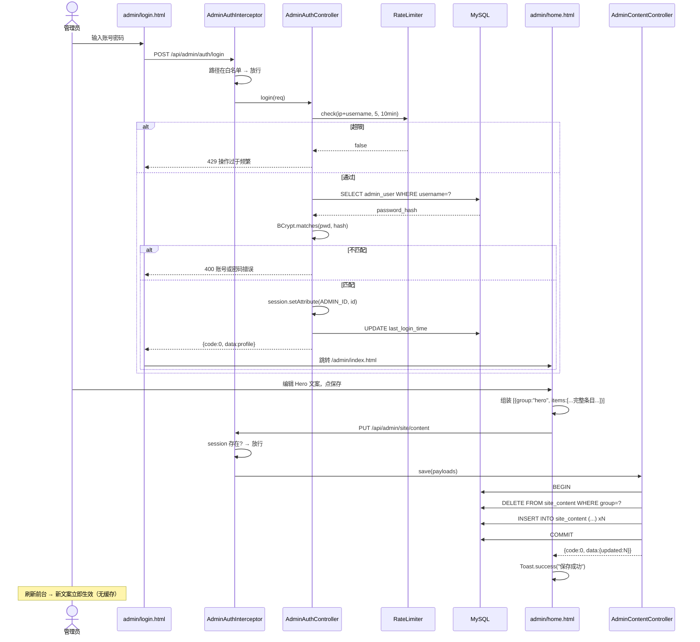
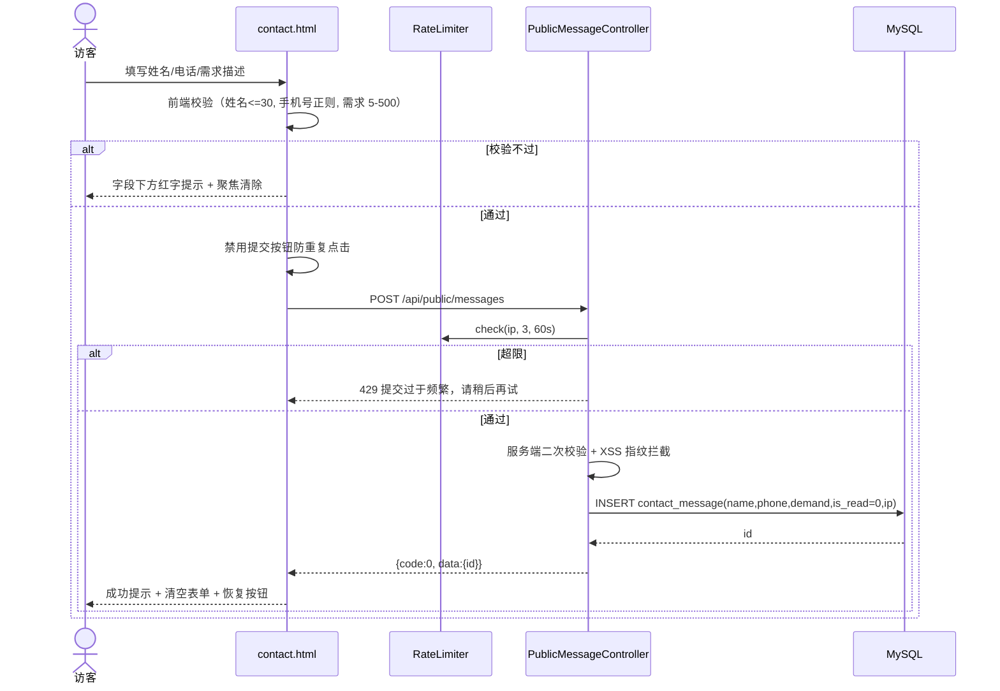

# 顺德分布式科技艺术有限公司官网 — 系统设计 & 任务分解

| 项 | 内容 |
| --- | --- |
| 文档版本 | v1.0（架构师：高见远） |
| 上游输入 | `docs/PRD.md` v1.0（86 条需求池 / 11 张表 / 16+43 接口草案 / UI 规范） |
| 项目根 | `C:\Users\Patrick\WorkBuddy\2026-09-16-16-14-53\sdtech`（下文 `/` 指该目录） |
| 技术栈 | 前后台：多页面纯 HTML + Tailwind CSS + 原生 JS（无构建、无框架、无 npm 运行时依赖）<br>后端：Spring Boot 3.2.5 + Java 17 + MyBatis-Plus 3.5.7 + MySQL 8.0 + Maven<br>部署：Docker + docker-compose（nginx + app + mysql），对外仅 80 |

---

## 0. 架构师决策摘要（拍板结果）

| # | 议题 | 结论 |
| --- | --- | --- |
| D1 | 鉴权 | **Session（Cookie + HttpOnly + SameSite=Lax）**，不用 JWT（三条理由见 §3.1） |
| D2 | 管理员凭据 | **环境变量注入** `ADMIN_USERNAME` / `ADMIN_PASSWORD`（默认 `admin` / `admin123`），应用启动播种并 BCrypt 落库；**种子 SQL 不插管理员、全仓库无明文密码** |
| D3 | Tailwind 交付 | **主方案：本机预编译 `frontend/assets/css/tailwind.min.css`**（离线可用）；降级：CDN + inline config。见 §3.2 |
| D4 | 图片策略 | picsum 固定 seed 存 URL + 统一 `ui.img()` helper + `onerror` 三级降级到本地 `assets/img/placeholder.svg`。见 §3.3 |
| D5 | 静态 vs API | nginx 托管 `frontend/`；`/api/**` 反代到 app、`/uploads/**` alias 到共享卷；前端 API 基址恒为相对路径 `/api`，**同源，零跨域配置** |
| D6 | 数据库初始化 | `sql/01-schema.sql` + `sql/02-data.sql` 挂 `/docker-entrypoint-initdb.d`，全部 `IF NOT EXISTS` / 组级先删后插，**可重复安全**；Spring Boot `spring.sql.init.mode: never` |
| D7 | 文件上传 | 落盘 `/app/uploads/yyyy/MM/uuid.ext`（命名卷），DB 存相对 URL `/uploads/...`；≤5MB；白名单 jpg/png/webp/gif/svg |
| D8 | FAQ/流程/优势 | **沿用 11 表，不新增表**。用 `site_content` 的 `group + "序号.字段"` 键表达同构列表，“整组替换”式保存。见 §5.12 |
| D9 | 表命名 | PRD 的 `service` 表更名 **`biz_service`**（规避 MySQL 关键字歧义，实体类 `BizService`）。其余表名不变 |
| D10 | 富文本 | **全站纯文本**，无富文本编辑器。`value_type` 仅 `text/image/url/switch`，多行靠 CSS `white-space: pre-wrap`。彻底消除存储型 XSS |
| D11 | 缓存 | **P0 不做服务端缓存、前端不缓存 `site/content`**（数据 <200 行，毫秒级），保证“后台保存 → 前台刷新即生效”零偏差；仅 nginx 对静态资源/上传加 `Cache-Control` |
| D12 | 时间格式 | 统一 `yyyy-MM-dd HH:mm:ss`（Jackson `time-zone: Asia/Shanghai`）。**有意偏离 PRD 的 ISO-8601**：前端只做字符串展示，规避 Safari 对 ISO 串的解析差异 |
| D13 | 目录 | 团队预告的 `frontend/pages/` **不使用**（PRD §3.2 要求 8 个前台页在站点根），请删除该空目录避免误导 |

---

## 1. 硬约束（工程师必须遵守）

### 1.1 环境与部署硬事实（已实测，不得违背）

1. 服务器 `106.52.219.144`（Ubuntu 24.04 / Docker 29.6 / Compose v5.3）**无法访问 github.com**（curl 15s 超时）；可访问 `cdn.tailwindcss.com`、`picsum.photos`、`placehold.co`、`repo.maven.apache.org`、`mirrors.tencent.com`。
   → **部署走「SFTP 上传源码 → 服务器本地 `docker compose build/up`」，严禁依赖服务器 git clone。**
2. Dockerfile 多阶段构建固定用已缓存镜像：`maven:3.9-eclipse-temurin-17`（build）+ `eclipse-temurin:17-jre-jammy`（runtime，拉取失败降级 `eclipse-temurin:17-jre`）；**build 阶段必须使用腾讯 Maven 镜像**（`-s docker/maven-settings.xml`）。
3. 主机端口：80 空闲；443/1993 被 `finance-nginx` 占用；3306 被 `finance-mysql` 占用。
   → nginx 映射 `80:80`；**mysql 不映射主机端口**，只在 compose 内网暴露 3306；app 可映射 `8080:8080` 供调试（可随时注释），对外只经 nginx `/api` 反代。
4. 可用内存约 2.5G → JVM `-Xmx512m -Xms256m`；MySQL 默认配置。
5. 本机 Windows：Java 17 可用但 **Maven 命令行不可用** → 本地不构建 jar，统一 Docker 多阶段构建。

### 1.2 产品硬约束

- 前台**所有**文字/图片/链接来自接口；页面 HTML 只允许保留“加载中 / 加载失败兜底文案”与骨架屏，**禁止任何写死的业务文案**。
- 初始数据**不得虚构**客户名、公司名、备案号、电话、微信号。一律占位（`待补充` / `备案号：待填写` / `企业官网改版示例` 这类中性名）。
- 视觉：高端 B 端商务风，低饱和配色（主色 `#3B6EA5` / 深 `#2E5A87`、炭黑 `#1F2328`、边框 `#E2E6EA`、点缀金 `#B08D57` **每屏最多 1 处**），充足留白，卡片圆角 12px，8pt 间距（4/8/12/16/24/32/40/64/96/128），Tailwind 默认断点。
- **动效克制**：仅允许平滑滚动、hover 过渡（150–300ms）、淡入；**禁止**粒子/3D/闪烁/呼吸灯/跑马灯/自动轮播/`animation-iteration-count: infinite`/超过 400ms 的过渡；必须支持 `@media (prefers-reduced-motion: reduce)`。
- 必须完美移动端自适应：360–1920px 无横向滚动、无错位。
- 全仓库 grep 不到明文密码；docker-compose 通过 `.env` 引用。

---

## 2. 总体架构



| 路径 | 处理者 | 说明 |
| --- | --- | --- |
| `/`、`/index.html`…`/admin/*`、`/assets/**` | nginx 静态托管 | 根 `/usr/share/nginx/html` = `./frontend`；assets 加 `Cache-Control: public, max-age=604800` |
| `/uploads/**` | nginx `alias /var/www/uploads/` | 与 app 共享命名卷；加长缓存 |
| `/api/public/**` | app（无鉴权） | 只读 + 留言提交 |
| `/api/admin/**` | app（需登录） | `AdminAuthInterceptor`，未登录 401 |
| HTML 文档 | nginx | `Cache-Control: no-cache`，保证改完即时生效 |

**为什么 nginx 直托管 `/uploads` 而不走 Spring Boot**：少一次 JVM IO，2.5G 内存环境更稳；PRD 草案里的 `GET /api/public/uploads/{fileName}` **取消**。

---

## 3. 关键选型决策

### 3.1 鉴权：Session（Cookie + HttpOnly + SameSite=Lax）

| # | 理由 |
| --- | --- |
| 1 | **攻击面更小**：`HttpOnly` Cookie 使 JS 读不到凭据，天然免疫“token 被 XSS 窃取”；JWT 存 `localStorage/sessionStorage` 会把凭据暴露给任何注入脚本，要规避还得引入 refresh-token + 内存态管理，复杂度反而更高。 |
| 2 | **可即时失效**：单管理员场景下“改密/踢下线/超时”必须立刻生效。Session 只需 `session.invalidate()`；无状态 JWT 做不到，必须额外维护黑名单或极短过期 + 续期。 |
| 3 | **同源 + 单人 + 无横向扩展需求**：前后端同域（同一 nginx），无跨域、无移动端/小程序接入、不做多管理员，压根用不到 JWT 的“无状态跨端”优势；Spring Boot 原生 `HttpSession` 零依赖实现，代码量最少，契合单人维护与 2.5G 内存的现实。 |

```yaml
server:
  servlet:
    session:
      timeout: 8h          # A-02：8 小时
      cookie:
        http-only: true
        same-site: lax
        path: /
```

- **不强制** `Secure`（站点 http；上 https 后再开）。
- Session 存 Tomcat 内存：**容器重启需重新登录**，这是明确记录的权衡。不引入 Redis / Spring Session。
- `AdminAuthInterceptor` 拦截 `/api/admin/**`，**仅放行 `/api/admin/auth/login`**。
- 前端 admin fetch 显式 `credentials: 'same-origin'`。
- CSRF：不引入 Spring Security CSRF token。补偿：`SameSite=Lax` 阻断跨站 POST 携带 Cookie；写操作一律走 `POST/PUT/PATCH/DELETE`，绝不用 GET 改状态。

### 3.2 Tailwind 交付：主方案 = 本机预编译

**主方案（必须尝试）** — 在本机执行一次：

```bash
cd /sdtech
npx --yes tailwindcss@3 -c tailwind.config.js \
  -i frontend/assets/css/tailwind.src.css \
  -o frontend/assets/css/tailwind.min.css --minify
```

`tailwind.config.js`（仓库根）：

```js
module.exports = {
  content: ['./frontend/**/*.html', './frontend/**/*.js', './README.md'],
  theme: { extend: {
    colors: { primary:'#3B6EA5', primaryDark:'#2E5A87', primarySoft:'#EAF0F7',
              ink:'#1F2328', inkDeep:'#3A3F45', inkMid:'#5A6169', inkWeak:'#8B929A',
              line:'#E2E6EA', surface:'#EDF0F3', surfaceSoft:'#F7F8FA',
              accent:'#B08D57', success:'#4A7C59' },
    borderRadius: { card:'12px', ctl:'8px', icon:'10px' },
    fontFamily: { sans: ['-apple-system','BlinkMacSystemFont','Segoe UI','PingFang SC','Hiragino Sans GB','Microsoft YaHei','Noto Sans SC','Inter','sans-serif'] },
    transitionTimingFunction: { DEFAULT: 'cubic-bezier(.4,0,.2,1)' }
  }},
  plugins: []
}
```

- `frontend/assets/css/tailwind.src.css`：`@tailwind base; @tailwind components; @tailwind utilities;` + 少量 `@layer` 覆盖。
- HTML 引用（8 前台页 + 8 后台页统一，**用绝对路径**，后台页不要写 `../assets/`）：
  ```html
  <link rel="stylesheet" href="/assets/css/tailwind.min.css">
  <link rel="stylesheet" href="/assets/css/app.css">
  ```
- 产物提交进仓库。体积约 20–40KB。**任何新增 class 都要重跑编译命令** —— 写进 README。
- 优势：线上不依赖外网、无 CDN TTFB、无 FOUC。

**降级方案（仅当 npx 编译在本机确实失败）**

```html
<script src="https://cdn.tailwindcss.com"></script>
<script>tailwind.config = {/* 同上 theme.extend */}</script>
```

README 顶部须写明当前模式与切换方式。**二选一，禁止混用**：启用 CDN `<script>` 时必须删除 `tailwind.min.css` 的 `<link>`。

### 3.3 图片策略

- 种子 URL 全部 `https://picsum.photos/seed/{seed}/{w}/{h}`（**固定 seed 防跳变**）：
  Hero `sdtech-hero` 1600×900｜业务封面 `sdtech-svc-web` 800×600｜案例封面 `sdtech-case-1` 800×600
- 统一走 `ui.img()`，禁止页面直写 ``。降级链路：
  `src` → `https://placehold.co/{w}x{h}/EDF0F3/8B929A?text=SDTech` → `/assets/img/placeholder.svg`（本地必达最终兜底）
- `placeholder.svg` 由工程师生成：`#EDF0F3` 底 + `#8B929A` 几何块，低饱和灰蓝，无外链依赖。

### 3.4 数据库初始化与幂等

- `01-schema.sql` 开头：`CREATE DATABASE IF NOT EXISTS sdtech; USE sdtech;` 随后 11 张 `CREATE TABLE IF NOT EXISTS`。
- `02-data.sql`：结构化实体用 `INSERT ... ON DUPLICATE KEY UPDATE`（需唯一键支撑）；`site_content` 采用**逐组 `DELETE FROM site_content WHERE content_group='x'; INSERT ...`**，直观且幂等。
- 挂载 `./sql:/docker-entrypoint-initdb.d:ro`（仅首次、卷为空时执行）。
- Spring Boot `spring.sql.init.mode: never`；README 给本地手动导入命令：
  ```bash
  docker compose exec -T mysql mysql -uroot -p"$MYSQL_ROOT_PASSWORD" sdtech < sql/01-schema.sql
  docker compose exec -T mysql mysql -uroot -p"$MYSQL_ROOT_PASSWORD" sdtech < sql/02-data.sql
  ```

### 3.5 文件上传

| 项 | 约定 |
| --- | --- |
| 存储根 | `sdtech.upload.dir=/app/uploads`，命名卷 `sdtech-uploads:/app/uploads` |
| 子目录 | `yyyy/MM/`（后端按当天创建） |
| 文件名 | `UUID + 原扩展名`（防冲突 + 防路径穿越）；原始名只存 `file_name` 展示 |
| 入库值 | 相对 URL `/uploads/2026/09/xxxx.png`（同源，换域名不改数据） |
| 限制 | ≤5MB（`spring.servlet.multipart.max-file-size=5MB`） |
| 白名单 | `jpg/jpeg/png/webp/gif/svg`，扩展名 + Content-Type 双校验，拒绝返回 `400 不支持的图片格式，仅支持 jpg/png/webp/gif/svg` |
| nginx | `location /uploads/ { alias /var/www/uploads/; }`（不在 HTML 根内） |

---

## 4. 目录结构树（施工图纸）

```
/  (sdtech)
├── README.md                # 部署/使用/Tailwind 模式切换/手动导库 的唯一入口
├── .gitignore               # target/ node_modules/ *.log uploads/ .env
├── .env.example             # 环境变量样例（无真实密钥）
├── docker-compose.yml       # nginx(80) + app(8080) + mysql(内网)，含 healthcheck 与 volume
├── tailwind.config.js       # 仅本机编译期使用，不进镜像
│
├── docker/
│   ├── Dockerfile           # 多阶段：maven 构建 → jre 运行
│   └── maven-settings.xml   # 腾讯 Maven 镜像
│
├── nginx/
│   └── default.conf         # 静态根、/uploads alias、/api 反代、X-Forwarded-For、gzip、Cache-Control
│
├── sql/
│   ├── 01-schema.sql        # 建库 + 11 张表 DDL
│   └── 02-data.sql          # 全量种子（管理员除外）
│
├── backend/
│   ├── pom.xml
│   └── src/main/
│       ├── java/com/sdtech/website/
│       │   ├── WebsiteApplication.java          # 启动入口 @SpringBootApplication + @MapperScan
│       │   ├── common/
│       │   │   ├── Result.java                  # 统一返回 {code,message,data}
│       │   │   ├── ResultCode.java              # 0/400/401/403/404/429/500
│       │   │   ├── BusinessException.java
│       │   │   ├── GlobalExceptionHandler.java  # @RestControllerAdvice
│       │   │   ├── MetaObjectHandler.java       # 自动填充 create_time/update_time
│       │   │   ├── PageVO.java                  # {records,total,page,size,pages}
│       │   │   └── SessionContext.java          # 读写 HttpSession 中的管理员
│       │   ├── config/
│       │   │   ├── WebMvcConfig.java            # 注册拦截器 + /uploads/** 静态映射（本地调试用）
│       │   │   ├── MybatisPlusConfig.java       # PaginationInnerInterceptor(MYSQL)
│       │   │   ├── JacksonConfig.java           # 时间格式 + Asia/Shanghai
│       │   │   ├── AdminAuthInterceptor.java    # /api/admin/** 鉴权
│       │   │   └── AdminSeedRunner.java         # ApplicationRunner：空表播种 BCrypt 管理员
│       │   ├── util/{IpUtil,RateLimiter,ValidatorUtil}.java
│       │   ├── entity/                          # 11 个，与表一一对应
│       │   │   ├── AdminUser.java BizService.java ServiceItem.java ServiceDeliverable.java
│       │   │   ├── CaseProject.java CaseImage.java QuoteItem.java ShopLink.java
│       │   │   └── ContactMessage.java SiteContent.java UploadFile.java
│       │   ├── dto/req/                         # LoginReq ChangePasswordReq SiteContentSaveReq
│       │   │   │                                # ServiceSaveReq ServiceItemSaveReq DeliverableSaveReq
│       │   │   └──                              # CaseSaveReq QuoteSaveReq ShopLinkSaveReq MessageReq SortReq BatchReadReq
│       │   ├── dto/vo/                          # ServiceVO ServiceDetailVO ServiceItemVO DeliverableVO
│       │   │   │                                # CaseVO CaseDetailVO CaseImageVO CategoryVO QuoteVO
│       │   │   └──                              # ShopLinkVO FaqVO ProcessStepVO AdvantageVO SiteContentItem AdminProfileVO UploadVO ContactMessageVO
│       │   ├── mapper/                          # 11 个 @Mapper(BaseMapper)
│       │   ├── service/ + service/impl/         # Auth Content BizService Case Quote ShopLink Message Upload SiteContent（9 组）
│       │   └── controller/
│       │       ├── PublicSiteController.java     # health / site/content / faqs / process-steps / advantages
│       │       ├── PublicServiceController.java  # services / {slug} / {slug}/items
│       │       ├── PublicCaseController.java     # cases / featured / categories / {id}
│       │       ├── PublicQuoteController.java    # quotes / {serviceSlug}
│       │       ├── PublicShopController.java     # shop-links
│       │       ├── PublicMessageController.java  # POST messages
│       │       ├── AdminAuthController.java      # login / logout / profile / password
│       │       ├── AdminContentController.java   # GET+PUT site/content（整组替换）
│       │       ├── AdminServiceController.java   # 业务 CRUD+sort + items + deliverables
│       │       ├── AdminCaseController.java      # 案例 CRUD + featured + 图片
│       │       ├── AdminQuoteController.java     # 报价 CRUD
│       │       ├── AdminShopController.java      # 店铺链接 CRUD
│       │       ├── AdminMessageController.java   # 留言列表 / 未读 / 标记 / 批量 / 删除
│       │       └── AdminUploadController.java    # 上传 / 素材列表 / 删除
│       └── resources/
│           ├── application.yml
│           └── logback-spring.xml
│
└── frontend/
    ├── index.html           # 首页：Hero/业务卡/优势/精选案例/流程/店铺/FAQ/CTA/页脚
    ├── web.html             # 网页开发
    ├── design.html          # 美工设计
    ├── video.html           # 视频剪辑
    ├── office.html          # 办公定制
    ├── cases.html           # 案例作品：筛选+网格+弹窗+分页
    ├── pricing.html         # 合作报价：流程+8 报价卡+项目约定+声明
    ├── contact.html         # 联系我们：微信区+留言表单+店铺专区+FAQ 入口
    ├── assets/
    │   ├── css/
    │   │   ├── tailwind.src.css   # 编译入口（@tailwind 三件套 + @layer 微调）
    │   │   ├── tailwind.min.css   # 【主方案产物】提交进仓库
    │   │   ├── app.css            # 手写兜底层：reduced-motion、smooth scroll、骨架屏、pre-wrap
    │   │   └── admin.css          # 后台补充：表格斑马纹、侧栏抽屉、表单、Toast/Modal
    │   ├── js/
    │   │   ├── api.js             # fetch 封装：3s 超时、统一错误、ApiError
    │   │   ├── ui.js              # esc/el/img/skeleton/toast/modal/accordion/fmtTime/empty
    │   │   ├── layout.js          # 注入导航 + 页脚 + 底部 CTA（数据驱动，8 页一致）
    │   │   ├── home.js            # 首页各区块渲染
    │   │   ├── service.js         # 4 个业务页通用渲染（按 pathname 推导 slug）
    │   │   ├── cases.js           # 列表/筛选/分页/详情弹窗/URL 参数还原
    │   │   ├── pricing.js         # 报价卡 + 流程 + 项目约定
    │   │   └── contact.js         # 表单校验提交 + 微信号复制 + 店铺专区 + FAQ 入口
    │   └── img/
    │       ├── placeholder.svg    # 最终图片兜底
    │       ├── favicon.svg
    │       └── icons/*.svg        # wechat/xianyu/taobao/pdd/check/arrow 等 lucide outline 内联源
    └── admin/
        ├── login.html index.html home.html services.html cases.html pricing.html shops.html messages.html
        └── assets/
            ├── admin-api.js       # 同源 fetch；401 自动跳登录；统一 Toast
            ├── admin-common.js    # 侧栏+顶栏注入、未读角标、Toast、确认框、表单序列化、上传控件
            ├── login.js dashboard.js home.js services.js cases.js pricing.js shops.js messages.js
```

**文件总数约 110 个**（后端 ~70 / 前端 ~36 / 部署配置 ~8）。

---

## 5. 数据库设计（11 张表）

### 5.0 全局约定

- `utf8mb4` / `utf8mb4_unicode_ci` / InnoDB。
- 主键 `id BIGINT AUTO_INCREMENT`；时间用 **`DATETIME`**（不用 TIMESTAMP，避免 2038 与时区隐式转换）：`create_time DATETIME DEFAULT CURRENT_TIMESTAMP`、`update_time DATETIME DEFAULT CURRENT_TIMESTAMP ON UPDATE CURRENT_TIMESTAMP`，并由 `MetaObjectHandler` 兜底填充。
- 软删除：业务实体带 `deleted TINYINT DEFAULT 0`（MP 逻辑删除）。**例外**：`admin_user`、`site_content`、`upload_file`、`service_item` 之外的从表按备注走物理删除。
- 所有 `status`：`1=启用/显示 0=禁用/隐藏`。
- 金额不用 DECIMAL —— 报价是**展示文本**（区间/面议），用 VARCHAR。

### 5.1 `admin_user`

| 字段 | 类型 | 空 | 说明 |
| --- | --- | --- | --- |
| id | BIGINT | N | PK AI |
| username | VARCHAR(64) | N | **UNIQUE** |
| password_hash | VARCHAR(128) | N | BCrypt |
| real_name | VARCHAR(64) | Y | 默认“管理员” |
| last_login_time | DATETIME | Y | |
| status | TINYINT | N | 默认 1 |
| create_time / update_time | DATETIME | N | |

索引 `UNIQUE KEY uk_username(username)`；无 `deleted`（物理删除）。**02-data.sql 不插此表**，由 `AdminSeedRunner` 播种。

### 5.2 `biz_service`（8 项）

| 字段 | 类型 | 空 | 说明 |
| --- | --- | --- | --- |
| id | BIGINT | N | PK AI |
| slug | VARCHAR(64) | N | **UNIQUE**：8 个业务标识 + 4 个页面级标识同批表达 |
| name | VARCHAR(64) | N | 业务名 |
| subtitle | VARCHAR(255) | Y | 业务页 Banner 副标题（仅页面级有值） |
| summary | VARCHAR(500) | Y | 业务页介绍段落 |
| icon | VARCHAR(64) | Y | 图标 key（前端 `ICONS[key]` 映射内联 SVG） |
| cover_image | VARCHAR(512) | Y | picsum 占位 |
| target_url | VARCHAR(255) | Y | 如 `web.html#web-redesign` |
| page_key | VARCHAR(32) | Y | `web/design/video/office` |
| sort_order | INT | N | 默认 0 |
| status | TINYINT | N | 默认 1 |
| deleted | TINYINT | N | 默认 0 |
| create_time / update_time | DATETIME | N | |

索引 `UNIQUE uk_slug(slug)`、`KEY idx_page(page_key,status,sort_order)`。

8 条种子：`web-redesign`(旧官网改造,web)、`web-new`(新官网设计,web)、`web-miniapp`(微信小程序开发,web)、`web-app`(Web应用开发,web)、`design-poster`(海报设计,design)、`design-product`(产品图设计,design)、`video-edit`(视频剪辑,video)、`office-doc`(办公定制,office)。其中 4 条页面级记录（`slug`=web/design/video/office）额外承载 Banner 副标题与介绍段落，作为该页主体。

### 5.3 `service_item`（12 项）

| 字段 | 类型 | 空 | 说明 |
| --- | --- | --- | --- |
| id | BIGINT | N | PK AI |
| service_id | BIGINT | N | 所属业务（逻辑外键） |
| title | VARCHAR(128) | N | |
| description | VARCHAR(500) | Y | |
| icon | VARCHAR(64) | Y | |
| sort_order | INT | N | 默认 0 |
| status | TINYINT | N | 默认 1 |
| deleted | TINYINT | N | 默认 0 |
| create_time / update_time | DATETIME | N | |

索引 `KEY idx_service(service_id,status,sort_order)`。分布：web 4 / design 2 / video 3 / office 3。

### 5.4 `service_deliverable`（12 条）

| 字段 | 类型 | 空 | 说明 |
| --- | --- | --- | --- |
| id | BIGINT | N | PK AI |
| service_id | BIGINT | N | 所属业务 |
| content | VARCHAR(255) | N | 交付物条目 |
| icon | VARCHAR(64) | Y | 默认 `check` |
| sort_order | INT | N | 默认 0 |
| create_time / update_time | DATETIME | N | |

索引 `KEY idx_service(service_id,sort_order)`。从表，**物理删除**。

### 5.5 `case_project`

| 字段 | 类型 | 空 | 说明 |
| --- | --- | --- | --- |
| id | BIGINT | N | PK AI |
| title | VARCHAR(128) | N | 种子用中性占位名（如“企业官网改版示例”） |
| category | VARCHAR(32) | N | `web/design/video/office` |
| cover_image | VARCHAR(512) | Y | |
| summary | VARCHAR(1000) | Y | 项目简介 |
| tech_or_method | VARCHAR(500) | Y | 技术/制作方式 |
| deliver_result | VARCHAR(1000) | Y | 交付成果 |
| is_featured | TINYINT | N | 默认 0 |
| sort_order | INT | N | 默认 0 |
| status | TINYINT | N | 默认 1 |
| view_count | INT | N | 默认 0（预留） |
| deleted | TINYINT | N | 默认 0（软删除可恢复） |
| create_time / update_time | DATETIME | N | |

索引 `KEY idx_list(category,status,is_featured,sort_order,id)`、`KEY idx_featured(is_featured,status,sort_order)`。

### 5.6 `case_image`

| 字段 | 类型 | 空 | 说明 |
| --- | --- | --- | --- |
| id | BIGINT | N | PK AI |
| case_id | BIGINT | N | |
| image_url | VARCHAR(512) | N | |
| alt_text | VARCHAR(255) | Y | |
| sort_order | INT | N | 默认 0 |
| is_cover | TINYINT | N | 默认 0 |
| create_time / update_time | DATETIME | N | |

索引 `KEY idx_case(case_id,sort_order)`。联动：`is_cover=1` 时同步写 `case_project.cover_image`（冗余以避免列表 JOIN）。

### 5.7 `quote_item`（8 项）

| 字段 | 类型 | 空 | 说明 |
| --- | --- | --- | --- |
| id | BIGINT | N | PK AI |
| service_id | BIGINT | Y | 可 NULL（独立报价项） |
| item_name | VARCHAR(128) | N | |
| price_text | VARCHAR(64) | Y | 如 `2000-6000` / `面议` |
| price_unit | VARCHAR(32) | Y | `元/套`、`元/页`、`元/条` |
| description | VARCHAR(500) | Y | |
| sort_order | INT | N | 默认 0 |
| status | TINYINT | N | 默认 1 |
| deleted | TINYINT | N | 默认 0 |
| create_time / update_time | DATETIME | N | |

索引 `KEY idx_service(service_id,sort_order)`、`KEY idx_status(status,sort_order)`。前端：`price_text` 为空显示“面议”。

### 5.8 `shop_link`（4 条）

| 字段 | 类型 | 空 | 说明 |
| --- | --- | --- | --- |
| id | BIGINT | N | PK AI |
| platform | VARCHAR(32) | N | `wechat/xianyu/taobao/pdd/other` |
| title | VARCHAR(64) | N | |
| link_url | VARCHAR(512) | Y | 种子用 `#` 占位，待后台替换 |
| icon | VARCHAR(64) | Y | |
| qrcode_image | VARCHAR(512) | Y | 微信二维码 |
| show_zone | VARCHAR(128) | Y | 逗号分隔 `home,footer,contact,cta` |
| sort_order | INT | N | 默认 0 |
| status | TINYINT | N | 默认 1 |
| create_time / update_time | DATETIME | N | |

前端规则：`link_url` 为空或 `#` 且无二维码 → **隐藏该入口**（不死链）；外链统一 `target="_blank" rel="noopener noreferrer"`。

### 5.9 `contact_message`

| 字段 | 类型 | 空 | 说明 |
| --- | --- | --- | --- |
| id | BIGINT | N | PK AI |
| name | VARCHAR(64) | N | ≤30 |
| phone | VARCHAR(32) | N | 11 位手机号 |
| demand | VARCHAR(1000) | N | 5–500 字 |
| is_read | TINYINT | N | 默认 0 |
| source_page | VARCHAR(64) | Y | |
| ip_address | VARCHAR(64) | Y | 限流用，**不返回给前端** |
| remark | VARCHAR(500) | Y | 管理员备注（P2，字段先建） |
| create_time / update_time | DATETIME | N | |

索引 `KEY idx_read(is_read,create_time)`、`KEY idx_create(create_time)`。物理删除。

### 5.10 `site_content`（KV）

| 字段 | 类型 | 空 | 说明 |
| --- | --- | --- | --- |
| id | BIGINT | N | PK AI |
| content_group | VARCHAR(64) | N | `hero/advantage/process/faq/nav/footer/cta/contact/pricing_terms/banner/global` |
| content_key | VARCHAR(128) | N | 见下方键命名规则 |
| content_value | TEXT | Y | |
| image_url | VARCHAR(512) | Y | 配套图片 |
| value_type | VARCHAR(16) | N | `text/image/url/switch` |
| label | VARCHAR(128) | Y | 后台表单中文名 |
| sort_order | INT | N | 默认 0 |
| create_time / update_time | DATETIME | N | |

索引 `UNIQUE uk_group_key(content_group,content_key)`、`KEY idx_group(content_group,sort_order)`。
**不用逻辑删除**（物理删除 + 整组替换）—— 否则唯一键会与被删记录冲突，无法再写同 key。

**键命名规则（前后端共同契约）**

```
content_key = <段1>.<段2>[.<段3>]
- <段1> 为纯数字 → 同构列表项：<段1>=序号，<段2>=字段名
    group=advantage      key="1.title" "1.desc" "1.icon"
    group=process        key="1.title" "1.desc"
    group=faq            key="1.question" "1.answer"
    group=pricing_terms  key="1.title" "1.desc"
    group=nav            key="1.title" "1.url"
- 否则 → 普通分层键，直接按键取值
    group=hero    key="title" "subtitle" "description" "primary_button_text"
    group=banner  key="cases.title" "cases.subtitle" "web.title" "pricing.title"
    group=global  key="company_name" "phone" "icp" "copyright"
```

派生接口 `/api/public/advantages|process-steps|faqs` 由后端按“`.` 切第一段”解析成对象数组。**前端不需要知道此规则**（只消费结构化 VO）。

**种子 KV 清单（02-data.sql 必须完整）**

| group | key | type | 种子值 |
| --- | --- | --- | --- |
| global | company_name / company_short / slogan | text | 顺德分布式科技艺术有限公司 / 分布式科技艺术 / 数字化视觉与 Web 应用定制服务商 |
| global | logo_image | image | `/assets/img/favicon.svg` |
| global | phone / email / wechat_id / address | text | `待补充` |
| global | icp | text | `备案号：待填写` |
| global | copyright | text | `© 2026 顺德分布式科技艺术有限公司 保留所有权利` |
| nav | 1–8 `.title` / `.url` | text/url | 首页`/index.html`｜网页开发`/web.html`｜美工设计`/design.html`｜视频剪辑`/video.html`｜办公定制`/office.html`｜案例作品`/cases.html`｜合作报价`/pricing.html`｜联系我们`/contact.html` |
| hero | title / subtitle / description | text | 中性客观，不夸大 |
| hero | primary_button_text + `_link` | text/url | 查看案例 / `/cases.html` |
| hero | secondary_button_text + `_link` | text/url | 立即咨询 / `/contact.html` |
| hero | background_image | image | picsum seed `sdtech-hero` 1600×900 |
| advantage | 1–4 `.title`/`.desc`/`.icon` | text | 一站式能力 / 老站兼容改造 / AI 增效 / 多渠道下单 |
| process | 1–6 `.title`/`.desc` | text | 需求沟通→方案报价→支付定金→项目制作→修改优化→交付源文件 |
| faq | 1–5 `.question`/`.answer` | text | 报价核算 / 定金规则 / 免费修改次数 / 源文件交付 / AI 素材版权 |
| pricing_terms | 1–5 `.title`/`.desc` | text | 定金 / 免费修改 / 源文件交付 / AI 版权 / 拒单范围 |
| cta | title / description / button_text / button_link / background_image | 混合 | 准备启动你的项目？欢迎咨询 |
| footer | company_intro / social_note | text | 中性简介（不虚构客户） |
| contact | wechat_id / wechat_note / form_success_tip / shops_title | text | `待补充` + 提示文案 |
| contact | wechat_qrcode | image | picsum seed `sdtech-qr` 或本地占位 |
| banner | `web/design/video/office/cases/pricing/contact`.title + `.subtitle` | text | 各页 Banner |

### 5.11 `upload_file`

| 字段 | 类型 | 空 | 说明 |
| --- | --- | --- | --- |
| id | BIGINT | N | PK AI |
| file_name | VARCHAR(255) | N | 原始名（仅展示） |
| store_name | VARCHAR(255) | N | `UUID.ext` **UNIQUE** |
| file_path | VARCHAR(512) | N | 容器内绝对路径 |
| file_url | VARCHAR(512) | N | `/uploads/yyyy/MM/uuid.ext` |
| file_size | BIGINT | N | 字节 |
| mime_type | VARCHAR(64) | Y | |
| width / height | INT | Y | |
| uploader_id | BIGINT | Y | |
| create_time / update_time | DATETIME | N | |

索引 `UNIQUE uk_store(store_name)`、`KEY idx_create(create_time)`。物理删除（同时删磁盘文件，IO 异常忽略）。

### 5.12 为什么不加 FAQ/流程/优势三张表

PRD §8.4 允许 P1 再拆表，**本设计 P0 明确不拆**：这三类数据字段极少（2–3 个）、无查询压力、无需独立权限；用 `site_content` 的“序号.字段”键 + 整组替换接口可获得完全一样的增/删/改/排能力，避免多 3 张表 + 3 组 CRUD + 3 个后台表单。公开接口路径 `/api/public/advantages|process-steps|faqs` 保持不变，**未来若拆表前端零改动**。

---

## 6. 接口设计（59 个：公开 16 + 管理员 43）

**统一规范**：前缀 `/api`；JSON（上传除外）；返回 `{code,message,data}`，`code=0` 成功，HTTP 状态码同步表达。
错误码：`0` 成功 / `400` 参数校验失败 / `401` 未登录或会话失效 / `403` 禁止 / `404` 不存在 / `429` 过于频繁 / `500` 服务器错误。
时间 `yyyy-MM-dd HH:mm:ss`（Asia/Shanghai）。分页 `PageVO<T> = {records,total,page,size,pages}`。

### 6.1 公开读接口（16）

| 方法 | 路径 | 说明 | 参数 | 返回 `data` |
| --- | --- | --- | --- | --- |
| GET | `/api/public/health` | 健康检查 | — | `{status:"UP",time:"2026-09-16 10:00:00"}` |
| GET | `/api/public/site/content` | **一次性返回全站 KV 文案与图片** | `?group=hero` 可过滤 | `SiteContentItem[]` = `[{group,key,value,imageUrl,valueType,label,sortOrder}]` |
| GET | `/api/public/services` | 8 项业务卡 | — | `ServiceVO[]` |
| GET | `/api/public/services/{slug}` | 业务详情（含细分 + 交付物） | path | `ServiceDetailVO` = ServiceVO + `items[]` + `deliverables[]` |
| GET | `/api/public/services/{slug}/items` | 细分服务列表 | path | `ServiceItemVO[]` |
| GET | `/api/public/cases` | 案例分页 | `category,page(1),size(9),keyword` | `PageVO<CaseVO>` |
| GET | `/api/public/cases/featured` | 精选案例（`is_featured=1 & status=1`，sort_order 升 + id 降） | `limit`(4) | `CaseVO[]` |
| GET | `/api/public/cases/categories` | 分类 | — | `CategoryVO[]` = `[{code:"web",name:"网页开发"},…]` |
| GET | `/api/public/cases/{id}` | 详情含多图 | path | `CaseDetailVO` |
| GET | `/api/public/quotes` | 全部报价 | — | `QuoteVO[]` |
| GET | `/api/public/quotes/{serviceSlug}` | 某业务报价 | path | `QuoteVO[]` |
| GET | `/api/public/shop-links` | 店铺链接 | `zone=home/footer/contact/cta` | `ShopLinkVO[]` |
| GET | `/api/public/faqs` | FAQ（源自 group=faq） | — | `FaqVO[]` = `[{seq,question,answer}]` |
| GET | `/api/public/process-steps` | 流程 6 步 | — | `ProcessStepVO[]` |
| GET | `/api/public/advantages` | 优势 4 条 | — | `AdvantageVO[]` |
| POST | `/api/public/messages` | 提交留言（校验 + IP 限流） | `{name,phone,demand,sourcePage}` | `{id:12}` |

> PRD 草案中的 `GET /api/public/uploads/{fileName}` **已删除** —— 上传文件由 nginx 以 `/uploads/**` 直接托管。

### 6.2 管理员接口（43，需登录）

**Auth（4）**

| 方法 | 路径 | 说明 | 请求体 | 返回 |
| --- | --- | --- | --- | --- |
| POST | `/api/admin/auth/login` | 登录（**唯一放行**），写 Session | `{username,password}` | `AdminProfileVO` |
| POST | `/api/admin/auth/logout` | 登出 `invalidate()` | — | `true` |
| GET | `/api/admin/auth/profile` | 当前管理员 + 未读数 | — | `AdminProfileVO{username,realName,unreadCount,lastLoginTime}` |
| PUT | `/api/admin/auth/password` | 改密（校验旧密码，新密码 ≥8） | `{oldPassword,newPassword}` | `true` |

**站点内容（2）**

| 方法 | 路径 | 说明 | 请求体 | 返回 |
| --- | --- | --- | --- | --- |
| GET | `/api/admin/site/content` | 原始 KV（不派生，含隐藏） | `?group=` | `SiteContentItem[]` |
| PUT | `/api/admin/site/content` | **按组整组替换**（先删该组所有行再插入，@Transactional） | `[{group:"hero",items:[{key,value,imageUrl,valueType,label}]},…]` | `{updated:23}` |

> 整组替换让“新增/删除一条 FAQ”变得平凡：前端把该组完整列表回传即可。

**上传（3）**

| 方法 | 路径 | 说明 | 请求 | 返回 |
| --- | --- | --- | --- | --- |
| POST | `/api/admin/upload` | 上传图片 ≤5MB、白名单、UUID 重命名 | `multipart: file` | `UploadVO{id,fileName,fileUrl,fileSize,mimeType}` |
| GET | `/api/admin/upload/files` | 素材库分页 | `page,size` | `PageVO<UploadVO>` |
| DELETE | `/api/admin/upload/{id}` | 删记录 + 磁盘文件 | path | `true` |

**业务 / 细分 / 交付物（13）**

| 方法 | 路径 | 说明 | 请求体 | 返回 |
| --- | --- | --- | --- | --- |
| GET | `/api/admin/services` | 业务列表（含隐藏） | — | `ServiceVO[]` |
| POST | `/api/admin/services` | 新增 | `ServiceSaveReq` | `{id}` |
| PUT | `/api/admin/services/{id}` | 修改 | `ServiceSaveReq` | `true` |
| DELETE | `/api/admin/services/{id}` | 逻辑删除（级联下线 items） | — | `true` |
| POST | `/api/admin/services/{id}/sort` | 上下移动 | `{direction:"up"\|"down"}` | `true` |
| GET | `/api/admin/services/{id}/items` | 细分服务列表 | — | `ServiceItemVO[]` |
| POST | `/api/admin/service-items` | 新增细分 | `ServiceItemSaveReq{serviceId,…}` | `{id}` |
| PUT | `/api/admin/service-items/{id}` | 修改细分 | `ServiceItemSaveReq` | `true` |
| DELETE | `/api/admin/service-items/{id}` | 删除细分 | — | `true` |
| GET | `/api/admin/services/{id}/deliverables` | 交付物列表 | — | `DeliverableVO[]` |
| POST | `/api/admin/deliverables` | 新增交付物 | `DeliverableSaveReq{serviceId,content,icon}` | `{id}` |
| PUT | `/api/admin/deliverables/{id}` | 修改 | `DeliverableSaveReq` | `true` |
| DELETE | `/api/admin/deliverables/{id}` | 删除 | — | `true` |

**案例（8）**

| 方法 | 路径 | 说明 | 请求 | 返回 |
| --- | --- | --- | --- | --- |
| GET | `/api/admin/cases` | 列表（分页 + 分类 + 精选 + 时间倒序） | `page,size,category,featured,keyword` | `PageVO<CaseVO>` |
| POST | `/api/admin/cases` | 新增（含 `images:[]`） | `CaseSaveReq{title,category,coverImage,summary,techOrMethod,deliverResult,isFeatured,sortOrder,status,images:[{imageUrl,altText,sortOrder,isCover}]}` | `{id}` |
| GET | `/api/admin/cases/{id}` | 详情含图 | path | `CaseDetailVO` |
| PUT | `/api/admin/cases/{id}` | 修改（全量覆盖 images） | `CaseSaveReq` | `true` |
| DELETE | `/api/admin/cases/{id}` | 逻辑删除 | — | `true` |
| PATCH | `/api/admin/cases/{id}/featured` | 切换精选 | `{isFeatured:1}` | `true` |
| POST | `/api/admin/cases/{id}/images` | 追加图片 | `{imageUrl,altText,sortOrder,isCover}` | `{id}` |
| DELETE | `/api/admin/case-images/{id}` | 删单图 | path | `true` |

**报价（4）** `GET /api/admin/quotes`｜`POST /api/admin/quotes`｜`PUT /{id}`｜`DELETE /{id}`
请求体 `QuoteSaveReq{serviceId,itemName,priceText,priceUnit,description,sortOrder,status}`。

**店铺链接（4）** `GET /api/admin/shop-links`｜`POST`｜`PUT /{id}`｜`DELETE /{id}`
请求体 `ShopLinkSaveReq{platform,title,linkUrl,icon,qrcodeImage,showZone,sortOrder,status}`。

**留言（5）**

| 方法 | 路径 | 说明 | 请求 | 返回 |
| --- | --- | --- | --- | --- |
| GET | `/api/admin/messages` | 列表（分页 + `isRead` + 时间倒序） | `page,size,isRead` | `PageVO<ContactMessageVO>`（**不含 ip_address**） |
| GET | `/api/admin/messages/unread-count` | 未读数（角标） | — | `{count:3}` |
| PATCH | `/api/admin/messages/{id}/read` | 标记已读/未读 | `{isRead:1}` | `true` |
| POST | `/api/admin/messages/batch-read` | 批量已读 | `{ids:[1,2,3]}` | `{updated:3}` |
| DELETE | `/api/admin/messages/{id}` | 删除 | — | `true` |

---

## 7. 前端页面 ↔ 接口映射

> `SC` = `GET /api/public/site/content`（全站 KV，每页第一个请求）。
> 任何失败：兜底文案 + `console.warn`，**不抛未捕获异常、不白屏**。

| 页面 | 调用接口 | 渲染区块 |
| --- | --- | --- |
| **全部页面（公共）** | `SC`（`global`+`nav`+`footer`+`cta`）、`shop-links?zone=footer` | 顶部导航 8 项（当前页高亮）、页脚、底部 CTA |
| `index.html` | `SC`（hero/advantage/process/faq/cta）、`services`、`cases/featured?limit=4`、`shop-links?zone=home` | Hero、8 业务卡（hover 上浮 2px/200ms）、4 优势卡、精选案例 4 卡（空态“敬请期待”）、6 步流程（≥1024 横向 / <768 纵向）、店铺入口、FAQ 手风琴、CTA |
| `web/design/video/office.html` | `SC`（`banner.<slug>`）、`services/{slug}`、`quotes/{slug}`、`cases?category=<slug>&size=4`、`shop-links?zone=cta` | Banner、介绍段、细分卡（4/2/3/3）、交付物、该类案例预览、参考报价（空→面议）、咨询 CTA。**四页共用 `service.js` 与同一套 class** |
| `cases.html` | `SC`（banner.cases）、`cases/categories`、`cases?category=&page=&size=9`、`cases/{id}`（弹窗） | 分类 chips、网格 3/2/1 列、详情 Modal（左右切图、ESC/遮罩关、移动全屏）、分页、URL `?category=&page=` 还原 |
| `pricing.html` | `SC`（banner.pricing + pricing_terms）、`quotes`、`process-steps` | 全局声明、8 报价卡、6 步流程、项目约定、AI 版权、拒单声明（**中性灰底+图标，不用红色**）、底部 CTA |
| `contact.html` | `SC`（banner.contact + contact）、`shop-links?zone=contact`、`faqs`、`POST /public/messages` | 微信二维码（点击放大）+ 微信号复制、留言表单（校验+防重+3s 反馈）、店铺专区、FAQ 入口 |
| `admin/login.html` | `POST /api/admin/auth/login` | 失败提示“账号或密码错误” |
| `admin/index.html` | `auth/profile`、`messages/unread-count`、`cases`、`services` | 概览卡片 + 未读角标 |
| `admin/home.html` | `admin/site/content` GET+PUT、`admin/upload` | 按 group 折叠表单，图片字段带上传预览 |
| `admin/services.html` | 业务 5 接口 + 细分 4 接口 + 交付物 4 接口 | 列表 + 抽屉编辑 + 子项管理 |
| `admin/cases.html` | 案例 8 接口 + `admin/upload` | 列表/筛选/分页 + 抽屉（多图排序、封面指定、精选开关、删除二次确认） |
| `admin/pricing.html` | 报价 4 接口 | 价格/单位/说明/排序/显示 |
| `admin/shops.html` | 店铺 4 接口 + `admin/upload` | 平台/文案/链接/图标/二维码/展示位置/启用 |
| `admin/messages.html` | 留言 5 接口 | 倒序列表、未读加粗、单条/批量、删除二次确认、备注 |

---

## 8. 前端公共层设计

### 8.1 `frontend/assets/js/api.js`

```js
const API = '/api';            // 相对路径，同源；禁止写死域名/IP
const DEFAULT_TIMEOUT = 3000;  // G-05：3s 超时降级

async function request(method, path, { body, timeout = DEFAULT_TIMEOUT } = {})
// 1) AbortController 超时 → ApiError{code:-1, message:'请求超时'}
// 2) HTTP 401         → ApiError{code:401}（后台页由 admin-api.js 捕获后跳登录）
// 3) 非 JSON / 网络错误 → ApiError{code:-2}
// 4) code !== 0        → ApiError{code, message}
// 5) code === 0        → 返回 data
export const api = { get, post, put, patch, del };
```

- `Content-Type: application/json`，`JSON.stringify(body)`。
- **不缓存任何 `/api/public/**`**（保证后台改完刷新即生效）。
- 所有入口 `.catch(e => { console.warn('[sdtech]', e); FALLBACK.render(); })`，禁止未处理 rejection。

### 8.2 `frontend/assets/js/ui.js`

| 导出 | 职责 |
| --- | --- |
| `esc(s)` | 转义 `& < > " '`；**任何接口字符串入 DOM 前必须经它或 textContent** |
| `el(tag, props, children)` | 建元素：`props.text` 走 `textContent`；`props.html` **仅限代码内静态串** |
| `img(src, alt, w, h, cls)` | `` + 三级降级，返回元素 |
| `skeleton(n, cls)` | 骨架屏（G-09）—— **用静态灰块，不得 animation-infinite** |
| `toast(msg, type)` | 2.5s 后淡出 |
| `modal({title,bodyEl,footerEl})` | 遮罩淡入 150ms + 内容 scale .98→1 200ms；ESC/遮罩关；焦点陷阱 |
| `accordion(container)` | FAQ 折叠，`max-height` 过渡 ≤250ms，可多开 |
| `fmtTime(s)` | `2026-09-16 10:00:00` → `2026-09-16 10:00` |
| `empty(el, text)` | 空态（“敬请期待”/“暂无内容”） |

```js
function img(src, alt, w, h, cls='') {
  const el = document.createElement('img');
  el.loading='lazy'; el.alt=alt||''; el.width=w; el.height=h; el.className=cls;
  const ph = '/assets/img/placeholder.svg';
  el.onerror = () => { el.onerror = () => { el.src = ph; el.onerror = null; };
                       el.src = `https://placehold.co/${w}x${h}/EDF0F3/8B929A?text=SDTech`; };
  el.src = src || ph;
  return el;
}
```

### 8.3 `frontend/assets/js/layout.js`

- `Layout.mount({active:'index'})`，每页 body 末尾调用一次；HTML 只留 `<div id="site-header">` `<div id="site-footer">` `<div id="site-cta">` 三个空占位。
- 取 `SC` 建 Map → 渲染：
  - **导航**：group `nav` 的 `N.title`/`N.url`；匹配 `location.pathname` 加高亮；移动端汉堡 + 抽屉（滑入 250ms）。
  - **页脚**：footer.company_intro、导航复用、`global.phone/email/wechat_id/address`（`待补充` 显示占位）、店铺链接（`zone=footer`）、footer.copyright、global.icp。
  - **底部 CTA**：group `cta`，按钮跳 link 或联系页。
- **失败兜底**：注入硬编码的**纯兜底** 8 项菜单（属导航结构而非业务文案，允许存在），页脚显示“内容加载失败，请稍后刷新”，CTA 隐藏。

### 8.4 后台 `admin-api.js` + `admin-common.js`

- `adminApi.*`：同 `api.js`，外加 `credentials:'same-origin'`；捕获 `401` → `location.replace('/admin/login.html?redirect=' + encodeURIComponent(location.pathname))`。
- 写操作成功自动 `Toast.success('保存成功')`；失败 `Toast.error(message)` 且**不清空表单**（A-21）。
- `common.mountShell('cases')`：注入左侧 240px 导航（概览/首页内容/业务/案例/报价/店铺/留言 + 未读角标）与 56px 顶栏（用户名 + 退出）；<1024px 折叠抽屉。
- `common.confirm(title,text)` → Promise，所有删除强制二次确认（A-22）。
- `common.upload(inputEl)` → 选文件即传，回填隐藏 input + `` 预览。

---

## 9. 安全与校验

| 面 | 措施 |
| --- | --- |
| **凭据** | `ADMIN_USERNAME`/`ADMIN_PASSWORD` 环境变量注入；启动播种 BCrypt；**代码与 SQL 零明文密码**；`password_hash` 永不出现在任何接口返回 |
| **会话** | Cookie `HttpOnly + SameSite=Lax + Path=/`，8h；拦截器放行仅 `auth/login`；登出 `invalidate()`；后台页加载先请求 `auth/profile`，401 即跳登录（解决“返回键进后台”） |
| **登录限流** | 同 IP + 用户名，10 分钟内失败 5 次 → 锁定 10 分钟，返回 `429 操作过于频繁，请稍后再试`；成功清零 |
| **留言限流** | 同 IP 60 秒内最多 3 次（T-05），返回 `429` 友好提示（非 500） |
| **留言校验** | `name` 必填 ≤30 字；`phone` 必填且 `^1[3-9]\d{9}$`；`demand` 必填 5–500 字；**服务端同规则二次校验**（`@Valid` + 自定义），统一由 `GlobalExceptionHandler` 转 `400` |
| **XSS** | ①前端一律 `textContent`/`esc()`，**严禁 `innerHTML` 承载接口字符串**；②全站无富文本（D10）；③后端 `ValidatorUtil` 对 `name/demand/title/description` 做内容指纹拦截：命中 `<script`、`<iframe`、`javascript:`、`on\w+=` 直接 `400`；④IP 等敏感字段不下发前端 |
| **SQL 注入** | 全部走 MyBatis-Plus `Wrapper` / XML `#{}`；**禁止 `${}` 拼接**；`ORDER BY` 字段白名单映射；`keyword` 的 `like` 转义 `% _` |
| **上传** | 扩展名 + Content-Type 双白名单；≤5MB；UUID 重命名（丢弃原始名用于落盘，杜绝路径穿越）；返回相对 `/uploads/...`；`alias` 指向独立挂载点，不在 HTML 根内 |
| **CSRF** | `SameSite=Lax` + 写操作一律 `POST/PUT/PATCH/DELETE`，绝不用 GET 改状态 |

---

## 10. 任务分解

> 依赖顺序：**Batch A → (Batch B ∥ Batch C) → Batch D → 联调**。
> 接口契约已由本文档冻结，**B 与 C 可与 A 并行开工**，集成联调阻塞于 A。P1 项可延后但不阻断上线。

### Batch A — 后端 + 数据库（依赖：无）

**文件清单（约 70 个）**

```
sql/01-schema.sql                        # 建库 + 11 表 DDL（IF NOT EXISTS, utf8mb4_unicode_ci）
sql/02-data.sql                          # 全量种子（管理员除外），幂等
backend/pom.xml
backend/src/main/resources/{application.yml, logback-spring.xml}
backend/.../WebsiteApplication.java
backend/.../common/{Result,ResultCode,BusinessException,GlobalExceptionHandler,MetaObjectHandler,PageVO,SessionContext}.java
backend/.../config/{WebMvcConfig,MybatisPlusConfig,JacksonConfig,AdminAuthInterceptor,AdminSeedRunner}.java
backend/.../util/{IpUtil,RateLimiter,ValidatorUtil}.java
backend/.../entity/*.java                # 11 个
backend/.../mapper/*.java                # 11 个
backend/.../dto/req/*.java               # 12 个
backend/.../dto/vo/*.java                # 18 个
backend/.../service/*.java + impl/*.java # 9 组
backend/.../controller/*.java            # 14 个（6 公开 + 8 管理员）
```

**实施要点**
1. `application.yml`：数据源全占位符 `${DB_HOST:mysql}/${DB_PORT:3306}/${DB_NAME:sdtech}/${DB_USERNAME}/${DB_PASSWORD}`；MP 逻辑删除字段 `deleted`；Jackson 时间格式 + `Asia/Shanghai`；`spring.sql.init.mode: never`；multipart 5MB；session 8h/HttpOnly/SameSite=Lax；`sdtech.upload.dir=/app/uploads`；`admin.seed.username=${ADMIN_USERNAME:admin}`、`admin.seed.password=${ADMIN_PASSWORD:admin123}`。
2. `AdminAuthInterceptor` 排除清单**只含** `/api/admin/auth/login`。
3. `WebMvcConfig` 同时注册 `/uploads/**` → `file:${sdtech.upload.dir}/`（便于本地无 nginx 调试）。
4. `AdminSeedRunner`：`admin_user` 为空时播种，BCrypt 加密，日志打印“已初始化管理员：{username}”（**不打印密码**）。
5. 先跑通 16 个公开接口 + health 并 curl 自测，再写管理员接口。
6. `IpUtil` 依赖 nginx 透传：`proxy_set_header X-Forwarded-For $proxy_add_x_forwarded_for;`（Batch D 必须带上）。

### Batch B — 前台 8 页（可与 A 并行；联调阻塞于 A）

**文件清单（约 36 个）**

```
frontend/assets/css/{tailwind.src.css, tailwind.min.css, app.css}
frontend/assets/img/{placeholder.svg, favicon.svg}, frontend/assets/img/icons/*.svg
frontend/assets/js/{api.js, ui.js, layout.js}
frontend/assets/js/{home.js, service.js, cases.js, pricing.js, contact.js}
frontend/{index,web,design,video,office,cases,pricing,contact}.html
```

**实施要点**
1. **顺序**：先 `tailwind.src.css`/`app.css` 与编译 → `api.js` → `ui.js` → `layout.js` → 页面 JS → HTML。页面 HTML 只留 `<div id="xxx">` 骨架 + `<script>`。
2. HTML 中**唯一允许的中文**：加载失败兜底文案、`<meta description>` 占位、`alt` 缺省值。其余全部来自接口。
3. 每页独立 `<title>` + `<meta name="description">` + OG（G-08）。
4. 响应式四档 ≥1280/1024/768/375，容器 `max-w-[1200px]`，桌面 padding 32px / 移动 20px。
5. 动效只保留清单项；`app.css` 必须含 `@media (prefers-reduced-motion: reduce){*{transition:none!important;animation:none!important}}`。
6. 图片一律 `ui.img()`；4:3 封面 / 16:9 Hero / 1:1 图标，显式 `width/height` 防抖动。

### Batch C — 后台 8 页（可与 A 并行；联调阻塞于 A）

**文件清单（约 19 个）**

```
frontend/assets/css/admin.css
frontend/admin/{login,index,home,services,cases,pricing,shops,messages}.html
frontend/admin/assets/{admin-api.js, admin-common.js}
frontend/admin/assets/{login.js, dashboard.js, home.js, services.js, cases.js, pricing.js, shops.js, messages.js}
```

**实施要点**
1. 先 `admin-api.js` + `admin-common.js`（含未读角标、Toast、确认框、上传控件），再各页。
2. `home.html` 的保存必须走“整组替换”语义：只回传本次改动涉及的 group，且回传该组**完整**条目。
3. 所有删除走 `common.confirm`；所有写操作有成功/失败 Toast 且失败保留输入。
4. 后台页同样引入 `/assets/css/tailwind.min.css`（非预编译 class 不会生效，**新增 class 后必须重新编译并同时跑一遍 batch B 的检查**）。
5. 移动端：左侧导航折叠抽屉，表格容器 `overflow-x:auto`。

### Batch D — Docker + 部署文档（依赖：A + B + C 完成）

**文件清单（8 个）**

```
docker-compose.yml
docker/Dockerfile
docker/maven-settings.xml        # mirrors.tencent.com
nginx/default.conf
.env.example
.gitignore
README.md
```

**实施要点**
1. `docker-compose.yml`：
   - `mysql:8.0`：`env_file`/`environment` 读 `${MYSQL_*}`；**不映射主机端口**；volume `sdtech-mysql-data:/var/lib/mysql` + `./sql:/docker-entrypoint-initdb.d:ro`；`healthcheck: mysqladmin ping` 且 `start_period: 30s`。
   - `app`：`build.context: .`、`dockerfile: docker/Dockerfile`；`environment: SPRING_DATASOURCE_URL=jdbc:mysql://mysql:3306/sdtech?useUnicode=true&characterEncoding=utf8mb4&serverTimezone=Asia/Shanghai&allowPublicKeyRetrieval=true&useSSL=false`、`SPRING_DATASOURCE_USERNAME/PASSWORD`、`ADMIN_USERNAME/ADMIN_PASSWORD`、`JAVA_OPTS=-Xmx512m -Xms256m`；`depends_on.mysql.condition: service_healthy`；ports `8080:8080`（调试用，注明可注释）。
   - `nginx:alpine`：ports `80:80`；volumes `./frontend:/usr/share/nginx/html:ro`、`./nginx/default.conf:/etc/nginx/conf.d/default.conf:ro`、`sdtech-uploads:/var/www/uploads`；`depends_on: app`。
   - 顶层 `volumes: sdtech-mysql-data, sdtech-uploads`。
2. `Dockerfile`：
   - stage1 `maven:3.9-eclipse-temurin-17`：`COPY docker/maven-settings.xml /root/.m2/settings.xml` → `COPY backend/pom.xml` → `RUN mvn -B -q dependency:go-offline`（可容忍失败则跳过）→ `COPY backend/src` → `RUN mvn -B -q -DskipTests package`。
   - stage2 `eclipse-temurin:17-jre-jammy`（失败降级 `eclipse-temurin:17-jre`）：`COPY --from=builder app.jar /app.jar`；`ENV SPRING_PROFILES_ACTIVE=prod`；`EXPOSE 8080`；`ENTRYPOINT ["sh","-c","java $JAVA_OPTS -jar /app.jar"]`。
   - `.dockerignore` 排除 `frontend/`、`docs/`、`sql/`、`target/`。
3. `nginx/default.conf`：`root /usr/share/nginx/html;` `index index.html;`、`try_files $uri $uri/ /404.html;`、gzip on、`/api/ { proxy_pass http://app:8080/; proxy_set_header Host $host; proxy_set_header X-Real-IP $remote_addr; proxy_set_header X-Forwarded-For $proxy_add_x_forwarded_for; proxy_set_header X-Forwarded-Proto $scheme; client_max_body_size 6m; }`、`location /uploads/ { alias /var/www/uploads/; expires 7d; }`、HTML `Cache-Control: no-cache`。
4. `README.md` 必须包含：一键启动、环境变量说明、**Tailwind 模式判别与切换命令**、手动导库命令、上传目录说明、SFTP 上传源码 + `docker compose up -d --build` 的部署步骤、常见问题（Session 重启需重登、8080/3306 端口冲突规避）。
5. `.env.example` 只有键名与假值；`.gitignore` 含 `.env`、`uploads/`、`target/`、`node_modules/`。

---

## 11. 依赖清单（Maven，`backend/pom.xml`）

| 用途 | groupId:artifactId | 版本 | 说明 |
| --- | --- | --- | --- |
| parent | `org.springframework.boot:spring-boot-starter-parent` | `3.2.5` | 统一管理版本 |
| Web | `org.springframework.boot:spring-boot-starter-web` | 继承 | REST + Tomcat |
| Validation | `org.springframework.boot:spring-boot-starter-validation` | 继承 | `@Valid` 参数校验 |
| ORM | `com.baomidou:mybatis-plus-spring-boot3-starter` | `3.5.7` | **注意用 spring-boot3 starter**，非 `mybatis-plus-boot-starter` |
| 驱动 | `com.mysql:mysql-connector-j` | 继承（8.3.x） | runtime |
| 测试 | `org.springframework.boot:spring-boot-starter-test` | 继承 | test scope |
| MyBatis-Plus 代码生成器 | **不引入** | — | 实体/Mapper 手写，避免额外依赖与生成噪声 |
| Lombok | **不引入** | — | 手写 getter/setter 或直接用 IDE 生成，减少构建不确定性 |

```xml
<properties>
  <java.version>17</java.version>
  <mybatis-plus.version>3.5.7</mybatis-plus.version>
</properties>
```

前端：**零运行时依赖**。`tailwindcss@3` 仅在本机通过 `npx` 编译期使用，不进仓库依赖、不进镜像。

---

## 12. 跨文件共享约定（共享知识）

| 主题 | 约定 |
| --- | --- |
| **包路径** | `com.sdtech.website.{common,config,util,entity,dto.req,dto.vo,mapper,service,service.impl,controller}` |
| **命名** | Java 驼峰；DB/JSON 蛇形（`map-underscore-to-camel-case: true`）；URL 路径用**中划线**复数资源（`/shop-links`、`/case-images`） |
| **表前缀** | 无。表名即 snake_case；`biz_service` 例外（规避关键字） |
| **接口前缀** | 公开 `/api/public/**`（只读，唯一写入是 `POST /api/public/messages`）；管理员 `/api/admin/**`（全部需鉴权） |
| **返回结构** | `{code,message,data}`；`code=0` 成功；错误码 400/401/403/404/429/500 |
| **成功提示** | 写接口返回 `true` 或 `{id}`；Toast 文案由**前端**固定（“保存成功”），避免后端管文案 |
| **时间** | 一律 `yyyy-MM-dd HH:mm:ss`（Asia/Shanghai），不用 ISO-8601 |
| **ID** | 雪花/自增均可 → 统一 **数据库自增**，前端视为 number |
| **图片 URL 规则** | 三条允许形态：①`https://picsum.photos/seed/...`（种子）②`/uploads/yyyy/MM/uuid.ext`（上传）③`/assets/img/*.svg`（本地资源）。**除此以外不入库** |
| **外链** | 一律 `target="_blank" rel="noopener noreferrer"`；`link_url` 为 `#`/空 时隐藏入口 |
| **排序** | `sort_order` 升序，小的在前；未提供默认 0 |
| **前端 DOM 约定** | 每页占位 `<div id="site-header">` `<div id="site-footer">` `<div id="site-cta">` + 各区块 `<div id="xx-section">`；JS 只向这些容器 append |
| **禁止 innerHTML** | 接口字符串入 DOM 只能经 `textContent` 或 `ui.esc()` |
| **CSS class 与编译** | 新增任何 Tailwind class 后**必须重新执行编译命令**，否则线上不生效 |
| **动画** | 过渡 150–300ms；`prefers-reduced-motion` 全禁；禁止 `infinite` |
| **兜底文案** | 统一后缀“…暂时无法显示，请稍后刷新”；空态统一“敬请期待” |
| **颜色** | 只允许 §7.1 调色板；点缀金 `#B08D57` **每屏最多 1 处**；警告用中性灰，不用红色 |

---

## 13. 关键类图与调用时序

### 13.1 类图

```mermaid
classDiagram
    class Result {
        +int code
        +String message
        +Object data
        +ok(data) Result
        +fail(code, message) Result
    }
    class ResultCode {
        <<enum>>
        OK
        BAD_REQUEST
        UNAUTHORIZED
        FORBIDDEN
        NOT_FOUND
        TOO_MANY_REQUESTS
        INTERNAL_ERROR
    }
    class GlobalExceptionHandler {
        +handleBusiness(BusinessException) Result
        +handleValidation(MethodArgumentNotValidException) Result
        +handleUnknown(Exception) Result
    }
    class AdminAuthInterceptor {
        +preHandle(req, resp, handler) boolean
        -isPublicLoginPath(path) boolean
    }
    class AdminSeedRunner {
        +run(args) void
        -seedIfEmpty() void
    }
    class RateLimiter {
        +check(key, max, windowMs) boolean
        +clear(key) void
    }

    class PublicSiteController {
        +health() Result
        +content(group) Result
        +faqs() Result
        +processSteps() Result
        +advantages() Result
    }
    class PublicServiceController {
        +list() Result
        +detail(slug) Result
        +items(slug) Result
    }
    class PublicCaseController {
        +page(category, page, size, keyword) Result
        +featured(limit) Result
        +categories() Result
        +detail(id) Result
    }
    class PublicMessageController {
        +create(req) Result
    }
    class AdminAuthController {
        +login(req) Result
        +logout() Result
        +profile() Result
        +changePassword(req) Result
    }
    class AdminContentController {
        +get(group) Result
        +save(payloads) Result
    }
    class AdminCaseController {
        +page(q) Result
        +create(req) Result
        +update(id, req) Result
        +remove(id) Result
        +toggleFeatured(id, body) Result
    }
    class AdminUploadController {
        +upload(file) Result
        +files(page, size) Result
        +remove(id) Result
    }

    class SiteContentService {
        +listPublic(group) List
        +replaceGroup(group, items) int
        +derivedList(group, fields) List
    }
    class CaseService {
        +page(q) PageVO
        +featured(limit) List
        +detail(id) CaseDetailVO
        +create(req) Long
        +update(id, req) void
        +remove(id) void
    }
    class UploadService {
        +store(file) UploadVO
        +remove(id) void
    }
    class AuthService {
        +login(username, password, ip) AdminUser
        +changePassword(oldPwd, newPwd) void
    }

    class SiteContent {
        +Long id
        +String contentGroup
        +String contentKey
        +String contentValue
        +String imageUrl
        +String valueType
        +String label
        +Integer sortOrder
    }
    class BizService {
        +Long id
        +String slug
        +String name
        +String subtitle
        +String pageKey
        +String targetUrl
        +Integer sortOrder
    }
    class CaseProject {
        +Long id
        +String title
        +String category
        +String coverImage
        +Integer isFeatured
        +Integer status
    }
    class CaseImage {
        +Long id
        +Long caseId
        +String imageUrl
        +Integer isCover
    }
    class UploadFile {
        +Long id
        +String storeName
        +String fileUrl
        +Long fileSize
    }
    class ContactMessage {
        +Long id
        +String name
        +String phone
        +String demand
        +Integer isRead
    }

    PublicSiteController --> SiteContentService
    AdminContentController --> SiteContentService
    PublicCaseController --> CaseService
    AdminCaseController --> CaseService
    AdminCaseController --> UploadService
    AdminUploadController --> UploadService
    PublicMessageController --> RateLimiter
    AdminAuthController --> AuthService
    AuthService --> RateLimiter
    SiteContentService --> SiteContent
    CaseService --> CaseProject
    CaseService --> CaseImage
    CaseProject "1" *-- "n" CaseImage
    UploadService --> UploadFile
    GlobalExceptionHandler ..> Result : produces
    AdminAuthInterceptor ..> ResultCode : 401
    AdminSeedRunner ..> AuthService : seeds
```



### 13.2 前台首页渲染时序



### 13.3 管理员登录与内容保存时序



### 13.4 访客提交留言时序



---

## 14. 待明确事项（含默认建议，无需回问即可开工）

| # | 事项 | 默认建议 |
| --- | --- | --- |
| 1 | 是否需要 HTTPS/域名？ | **P0 只做 HTTP 80**。客户当前无域名与证书；后续若上 HTTPS，只需在 nginx 加 443 server 并把 80 重定向，**Session Cookie 需同时打开 `Secure`** |
| 2 | 备案号真实值未知 | 种子写 `备案号：待填写`，后台 `global.icp` 可改。符合“不伪造”约束 |
| 3 | 微信/电话等联系方式未知 | 全部 `待补充`，后台 `global.*` 可改。前台遇到 `待补充` 正常展示（明确提示“请在后台更新”）而非隐藏 |
| 4 | Session 存内存导致重启需重登 | **接受**。README 明确写明；如需持久化将来加 Spring Session JDBC（当前不引入） |
| 5 | 是否需要 CSRF Token | **不加**。`SameSite=Lax` + 非 GET 写操作已足够；接入 Spring Security 会显著抬高复杂度，与“越简单越好”冲突 |
| 6 | 是否需要操作审计日志 | **P0 不做**（PRD §8.5）。仅留 `last_login_time` 与 `remark` 字段 |
| 7 | 案例是否要真实数据 | **不要**。全部中性占位名 + picsum 占位图（PRD §8.7），后台替换后自动生效 |
| 8 | 移动端后台是否必须 | 是（A-20 P1）。只要做到侧栏抽屉 + 表格横向滚动即可，不做后台专属移动端布局 |

---

## 15. 验收对照表（对齐 PRD §9）

| # | 验收动作 | 依赖实现 |
| --- | --- | --- |
| 1 | 后台改一条首页文案 → 刷新前台即时生效 | `AdminContentController` 整组替换 + 前端无缓存（D11） |
| 2 | 后台上传图片替换 Hero → 前台立即显示 | `AdminUploadController` + 命名卷 + nginx `/uploads` alias |
| 3 | 后台新增案例（含 3 图）→ 案例页与首页精选同步 | `case_image` + `is_cover` 联动 + `cases/featured` |
| 4 | 后台改报价 → 报价页与业务页同步 | `quotes` 与 `quotes/{serviceSlug}` 同源查询 |
| 5 | 后台改闲鱼链接 → 首页/页脚/联系页三处同步 | `shop_link.show_zone` 逗号过滤 |
| 6 | 前台提交留言 → 后台留言列表出现未读，可标记已读 | `PublicMessageController` + `AdminMessageController` |
| 7 | 停掉后端 → 前台 8 页仍可浏览（兜底 + 占位图） | `api.js` 降级 + `ui.img()` 三级降级 + `layout.js` 兜底导航 |
| 8 | 全仓无明文密码；`docker compose up -d` 一次成功 | 环境变量 + `AdminSeedRunner` + Batch D |
