# 顺德分布式科技艺术有限公司 — 官网 + 可视化管理后台

| 项目信息 | 内容 |
| --- | --- |
| 项目名（snake_case） | `sdtech_official_site` |
| 客户 | 顺德分布式科技艺术有限公司（以下简称"分布式科技艺术"） |
| 语言 | 简体中文 |
| 前台技术栈 | 纯 HTML + Tailwind CSS（CDN）+ 原生 JS，多页面（MPA），无构建步骤 |
| 后台技术栈 | 纯 HTML + Tailwind CSS（CDN）+ 原生 JS，独立 `admin/` 目录，无构建步骤 |
| 后端技术栈 | Spring Boot 3.2.x + Java 17 + MyBatis-Plus + MySQL 8 |
| 鉴权 | **建议：Session（Cookie，HttpOnly + SameSite=Lax）+ 服务端内存/MySQL 会话**，详见 8.1 |
| 部署 | Docker + docker-compose（app + mysql + nginx），对外仅暴露 80 端口 |
| 文档版本 | v1.0 |

## 0. 原始需求复述

客户是一家小微服务商，提供 Web 开发、美工设计、视频剪辑、办公文档定制四类服务，主要获客渠道为微信、闲鱼、淘宝、拼多多。

需要一套**可自助改内容**的企业官网：

- **前台**：8 个一级页面（首页｜网页开发｜美工设计｜视频剪辑｜办公定制｜案例作品｜合作报价｜联系我们），一级导航无下拉，用于展示能力、案例、报价并承接咨询。
- **后台**：可视化管理后台（仅管理员使用），可改文字、换图片、管案例、管报价、管店铺链接、看客户留言，**改内容不需要改代码、不需要重新部署前端**。
- **核心硬约束**：前台所有文字/图片/链接全部来自后端接口（数据库驱动），前端只允许保留加载失败的兜底默认文案；所有图片默认使用网络占位素材，后台可上传替换。
- **视觉**：高端 B 端商务风（参考 Cruip、templatemo CleanStart），充足留白、低饱和商务配色、柔和圆角、精致排版；**动画极度克制**，禁止粒子/3D/闪烁等花哨特效；必须完美移动端自适应。

---

## 1. 产品目标

| # | 目标 | 衡量标准 |
| --- | --- | --- |
| G1 | **内容自治**：老板/运营无需接触代码即可更新全站文案、图片、案例、报价、店铺链接 | 全站 100% 文字与图片可由后台修改；单次文案改动平均耗时 ≤ 3 分钟，零代码、零重新部署 |
| G2 | **询盘转化**：把微信/闲鱼/淘宝/拼多多的自然流量沉淀为可留存的咨询线索 | 每一级页面（8 个页面 + 案例弹窗）均有可见 CTA；联系我们页留言表单提交成功率 ≥ 95%，提交后线索 100% 入库并可在后台查看 |
| G3 | **信任建立**：通过案例作品、明确报价区间、公开项目约定降低小微客户的决策门槛 | 案例页支持分类筛选 + 多图详情；报价页展示 8 项业务参考价格与完整项目约定（定金/修改次数/源文件/版权/拒单范围） |
| G4 | **品牌质感**：以克制的 B 端商务视觉建立"靠谱服务商"的第一印象 | 移动端 Lighthouse 性能 ≥ 85、无障碍 ≥ 90；1440px 与 375px 两种视口下无横向滚动、无错位 |
| G5 | **低运维成本**：单人可维护，一键启动、配置外置 | 一条 `docker compose up -d` 完成部署；数据库账号密码全部走环境变量；无硬编码凭据 |

---

## 2. 目标用户与用户故事

### 2.1 角色定义

| 角色 | 描述 | 核心诉求 |
| --- | --- | --- |
| **管理员（Admin）** | 公司老板或运营本人，1 人，全站唯一账号角色 | 快速改内容、上传新案例、看客户留言 |
| **潜在客户 / 访客（Visitor）** | 来自微信、闲鱼、淘宝、拼多多的中小微企业主、电商卖家、个体创业者 | 快速判断"这家能不能做我的活、大概多少钱、怎么联系" |

### 2.2 管理员视角用户故事（5 条）

1. 作为**管理员**，我想用账号密码登录后台，以便只有我能修改官网内容，防止他人误改。
2. 作为**管理员**，我想在一个表单里编辑首页的标题、标语、简介与按钮文字并实时预览，以便活动期间快速更换主推话术，而不用找开发改 HTML。
3. 作为**管理员**，我想上传图片直接替换首页与各业务页的配图，以便换上新做的项目图后立刻生效，无需改代码或重新部署。
4. 作为**管理员**，我想新增/编辑/删除案例并上传多张项目图片、选择所属分类，以便案例作品页与首页精选区自动同步更新。
5. 作为**管理员**，我想查看客户留言列表并标记已读/未读，以便不漏掉任何一条询盘线索，并知道哪些已经跟进过。
6. 作为**管理员**，我想在一个页面统一维护闲鱼/淘宝/拼多多/微信的链接，以便更换店铺地址时全站所有入口一次性生效。

### 2.3 访客视角用户故事（5 条）

1. 作为**潜在客户**，我想在首页一眼看清这家公司会做什么、有什么优势，以便 10 秒内决定要不要继续往下看。
2. 作为**潜在客户**，我想按分类浏览真实案例并点开看多图详情和交付成果，以便判断他们的水平是否匹配我的需求。
3. 作为**潜在客户**，我想看到各项服务的参考报价和定金/修改/源文件规则，以便先自行评估预算再决定是否咨询。
4. 作为**潜在客户**，我想直接在页面上点微信/闲鱼/淘宝/拼多多图标去对应平台下单或咨询，以便用我最习惯的方式联系。
5. 作为**潜在客户**，我想在联系我们页填写姓名、电话、需求描述并提交，以便不方便扫码时也能留下联系方式让对方回电。
6. 作为**潜在客户**，我想在手机上顺畅浏览全部页面，以便我在微信里点开链接时不会因为排版错乱而关掉。

---

## 3. 信息架构

### 3.1 结构图（Mermaid）

```mermaid
graph TD
    A[sdtech 官网] --> B[前台 / 多页面 MPA]
    A --> C[后台 admin/ / 仅管理员]

    B --> B1[首页 index.html]
    B --> B2[网页开发 web.html]
    B --> B3[美工设计 design.html]
    B --> B4[视频剪辑 video.html]
    B --> B5[办公定制 office.html]
    B --> B6[案例作品 cases.html]
    B --> B7[合作报价 pricing.html]
    B --> B8[联系我们 contact.html]

    B1 --> B1a[Hero 标题/标语/简介/双按钮]
    B1 --> B1b[八大业务卡片]
    B1 --> B1c[核心优势 4 卡]
    B1 --> B1d[精选案例 4 卡 + 查看全部]
    B1 --> B1e[合作流程时间线]
    B1 --> B1f[多平台店铺入口]
    B1 --> B1g[FAQ 折叠面板]
    B1 --> B1h[底部 CTA]
    B1 --> B1i[页脚]

    B2 --> B2a[Banner + 服务介绍]
    B2 --> B2b[细分服务 4 项]
    B2 --> B2c[交付物说明]
    B2 --> B2d[案例预览]
    B2 --> B2e[参考报价]
    B2 --> B2f[咨询 CTA]

    B3 --> B2a
    B4 --> B2a
    B5 --> B2a

    B6 --> B6a[Banner]
    B6 --> B6b[分类筛选标签]
    B6 --> B6c[网格卡片列表]
    B6 --> B6d[详情弹窗 多图]
    B6 --> B6e[分页]

    B7 --> B7a[合作流程时间线]
    B7 --> B7b[8 项业务参考报价卡]
    B7 --> B7c[项目约定]
    B7 --> B7d[底部 CTA]

    B8 --> B8a[微信咨询 二维码 + 微信号]
    B8 --> B8b[客户留言表单]
    B8 --> B8c[电商店铺专区]
    B8 --> B8d[FAQ 快捷入口]

    C --> C1[登录页 login.html]
    C --> C2[首页内容管理]
    C --> C3[业务管理 8 项]
    C --> C4[案例管理 CRUD]
    C --> C5[报价管理]
    C --> C6[店铺链接管理]
    C --> C7[留言管理]
    C --> C8[文件上传 / 素材库]

    C2 --> C2a[页脚/导航/CTA 文案]
    C3 --> C3a[业务页 Banner + 细分服务 + 交付物]
    C4 --> C4a[封面 + 多图 + 分类 + 项目信息]
```



### 3.2 树形文本（便于开发对照）

```
/                                     前台根目录
├── index.html                        首页
├── web.html                          网页开发
├── design.html                       美工设计
├── video.html                        视频剪辑
├── office.html                       办公定制
├── cases.html                        案例作品
├── pricing.html                      合作报价
├── contact.html                      联系我们
├── assets/                           静态资源（css/js/img，仅放图标与兜底图）
└── admin/                            后台根目录
    ├── login.html                    管理员登录
    ├── index.html                    后台首页/概览
    ├── home.html                     首页内容管理
    ├── services.html                 业务管理（8 项 + 细分服务）
    ├── cases.html                    案例管理
    ├── pricing.html                  报价管理
    ├── shops.html                    店铺链接管理
    ├── messages.html                 留言管理
    └── assets/                       后台静态资源
```

**全局区块（复用组件，数据来自 `/api/public/site/content`）**：顶部导航（8 项一级导航 + 右侧咨询按钮）、页脚（公司简介 / 全站导航 / 联系方式 / 店铺快捷链接 / 版权 ©2026 / 备案号占位）、底部 CTA、多平台店铺入口。

---

## 4. 需求池

优先级定义：**P0 = 必须有（上线阻塞项）**、**P1 = 应该有（二期或上线后一周内）**、**P2 = 锦上添花**。

### 4.1 全局与前台框架

| ID | 模块 | 需求描述 | 优先级 | 验收标准 |
| --- | --- | --- | --- | --- |
| G-01 | 全局 | 顶部导航：8 个一级导航项（无下拉），桌面端横向排列，移动端汉堡菜单抽屉 | P0 | 8 个链接均正确跳转；375px 下汉堡按钮可展开/收起，不出现横向滚动条 |
| G-02 | 全局 | 页脚：公司简介、全站导航、联系方式、店铺快捷链接、版权 ©2026、备案号占位 | P0 | 全部文案来自接口；备案号为空时显示占位文本 |
| G-03 | 全局 | 顶部导航与页脚在 8 个页面完全一致，由公共 JS 组件注入（不重复写死） | P0 | 组件加载一次即可渲染；修改接口内容后 8 个页面同步变化 |
| G-04 | 全局 | 所有页面数据由 `/api/public/*` 接口驱动，前端仅保留兜底默认文案 | P0 | 断开接口后页面不白屏，显示兜底文案且不报错中断 |
| G-05 | 全局 | 接口请求失败/超时（3s）降级：使用内联兜底文案 + picsum 占位图，控制台记录 warn | P0 | 人为停掉后端后，8 个页面仍可完整浏览 |
| G-06 | 全局 | 完美响应式：≥1280 / 1024 / 768 / 375 四档断点 | P0 | 360~1920px 全区间无横向滚动、无文字溢出、无元素重叠 |
| G-07 | 全局 | 平滑滚动（anchor 跳转 `scroll-behavior: smooth`），导航高亮当前页 | P0 | 页内锚点跳转平滑；当前页导航项有视觉高亮 |
| G-08 | 全局 | 页面基础 SEO：每个页面独立 `<title>`、`<meta name="description">`、OG 标签（文案可由后台配置） | P1 | 8 个页面的 title 各不相同且来源可配置 |
| G-09 | 全局 | 全局 Loading 骨架屏：内容区域在数据返回前显示占位骨架 | P1 | 首屏不出现空白闪烁；骨架与真实内容布局高度接近 |
| G-10 | 全局 | 每个页面底部复用"底部 CTA 区块"（文案后台可配） | P0 | 8 个页面均展示，点击可跳到联系我们或唤起微信链接 |

### 4.2 首页（index.html）

| ID | 模块 | 需求描述 | 优先级 | 验收标准 |
| --- | --- | --- | --- | --- |
| H-01 | 首页 Hero | 展示公司名"顺德分布式科技艺术有限公司"、标语"数字化视觉与Web应用定制服务商"、简介一段、双按钮（查看案例 / 立即咨询）、简约商务占位背景图 | P0 | 四项文案 + 背景图全部来自接口；按钮分别跳转案例页与联系我们页 |
| H-02 | 首页 业务卡片 | 八大业务卡片：旧官网改造 / 新官网设计 / 微信小程序开发 / Web应用开发 / 海报设计 / 产品图设计 / 视频剪辑 / 办公定制 | P0 | 8 张卡片顺序、名称、图标、图片、跳转链接均来自接口 |
| H-03 | 首页 业务卡片 | 卡片 hover 微动效：上浮 2px + 阴影加深 + 边框色变化，过渡 ≤ 250ms | P0 | 桌面端 hover 有明显但克制的反馈；移动端（无 hover）不出现异常样式残留 |
| H-04 | 首页 业务卡片 | 点击卡片进入对应业务详情页（通过 `slug` 或 `target_url` 映射） | P0 | 8 张卡片跳转目标正确：前 4 项→web.html，5-6→design.html，7→video.html，8→office.html，并可带锚点定位到细分服务 |
| H-05 | 首页 核心优势 | 4 张优势卡：一站式能力 / 老站兼容改造 / AI增效 / 多渠道下单 | P0 | 标题 + 描述 + 图标来自接口；后台可增删改 |
| H-06 | 首页 精选案例 | 精选案例预览 4 卡（封面图、项目名、分类标签）+【查看全部案例】按钮 | P0 | 取 `is_featured=1` 的最新 4 条；按钮跳案例页；无数据时显示"敬请期待"占位 |
| H-07 | 首页 合作流程 | 横向时间线：需求沟通→方案报价→支付定金→项目制作→修改优化→交付源文件 | P0 | 6 个节点；≥1024px 横向排列，<768px 自动转为纵向时间线 |
| H-08 | 首页 店铺入口 | 多平台店铺入口：微信咨询、闲鱼、淘宝、拼多多（4 个图标 + 文案 + 链接） | P0 | 链接来自 `/api/public/shop-links`；未配置时按钮隐藏而非显示死链 |
| H-09 | 首页 FAQ | 折叠面板：报价怎么核算 / 项目定金规则 / 免费修改次数 / 源文件什么时候交付 / AI素材版权说明 | P0 | 手风琴式展开收起（可多开）；高度过渡 ≤ 250ms；移动端单行高度自适应 |
| H-10 | 首页 CTA | 底部 CTA："准备启动你的项目？欢迎咨询" + 咨询按钮 | P0 | 文案、按钮文字、按钮链接均后台可配 |
| H-11 | 首页 页脚 | 页脚含公司简介、全站导航、联系方式、店铺快捷链接、版权 ©2026、备案号占位 | P0 | 与 G-02 一致；备案号占位显示为"备案号：待填写" |
| H-12 | 首页 性能 | 首屏（Hero）不依赖 JS 渲染关键文案时长 > 1.5s；其余模块异步加载 | P1 | Lighthouse 移动端 Performance ≥ 85 |

### 4.3 四个业务页（web / design / video / office）

| ID | 模块 | 需求描述 | 优先级 | 验收标准 |
| --- | --- | --- | --- | --- |
| S-01 | 业务页 通用 | 统一结构：Banner（标题 + 副标题）→ 服务介绍段落 → 细分服务卡片 → 交付物说明 → 该类案例预览 → 参考报价 → 咨询 CTA | P0 | 4 个页面使用同一套模板与 CSS 类，仅数据不同 |
| S-02 | 网页开发 | 副标题"官网搭建、旧站重构、微信小程序、Web应用定制开发"；细分 4 项：旧官网改造、新官网设计、微信小程序开发、Web应用开发 | P0 | 4 张细分卡数据来自接口；页面强调"可保留原后端接口只重构前端""具备 Java 基础 + AI 加速"（文案后台可改） |
| S-03 | 美工设计 | 副标题"海报设计｜电商产品图｜详情视觉｜品牌视觉素材"；细分 2 项：海报设计、产品图设计 | P0 | 强调"AI 辅助创作 + PS 精修"，适配阿里国际站/淘宝/拼多多/闲鱼；2 张细分卡数据来自接口 |
| S-04 | 视频剪辑 | 副标题"产品宣传短片、口播切片、商家短视频包装"；细分 3 项：产品宣传短视频、口播视频切片剪辑、字幕/转场/BGM 包装 | P0 | 3 张细分卡数据来自接口 |
| S-05 | 办公定制 | 副标题"PPT美化、文档排版、Excel模板定制"；细分 3 项：PPT美化与定制、Word文档排版、Excel自动化模板制作 | P0 | 3 张细分卡数据来自接口 |
| S-06 | 业务页 交付物 | 交付物说明区块（列表形式，含图标 + 文本） | P0 | 每页至少 3 条交付物；数据来自接口，后台可增删 |
| S-07 | 业务页 案例 | 该类业务案例预览（取对应分类最新 3-4 条）+ "查看全部案例"跳转 | P0 | 与案例页数据同源；无案例时显示占位文案 |
| S-08 | 业务页 报价 | 参考报价区块：显示本业务下各细分服务的参考价格区间 | P0 | 价格来自报价接口；价格为空时显示"面议" |
| S-09 | 业务页 CTA | 咨询 CTA 区块（微信咨询 / 留言 / 店铺入口其一或组合） | P0 | 至少 1 个可用咨询入口，链接后台可配 |

### 4.4 案例作品页（cases.html）

| ID | 模块 | 需求描述 | 优先级 | 验收标准 |
| --- | --- | --- | --- | --- |
| C-01 | 案例页 | Banner（标题 + 副标题，后台可配） | P0 | 文案来自站点配置 |
| C-02 | 案例页 | 分类筛选标签：全部 / 网页开发 / 美工设计 / 视频剪辑 / 办公定制 | P0 | 点击标签即时筛选（前端过滤或带参请求均可）；选中态有视觉区分 |
| C-03 | 案例页 | 网格卡片：封面图、项目名、分类标签 | P0 | 桌面 3 列 / 平板 2 列 / 手机 1 列；封面图统一 4:3 裁剪不拉伸 |
| C-04 | 案例页 | 点击卡片弹出详情弹窗（Modal）：项目简介、技术/制作方式、交付成果、多图展示 | P0 | 弹窗支持图片左右切换、ESC/点遮罩关闭、移动端全屏友好 |
| C-05 | 案例页 | 分页占位（上一页/下一页 + 页码） | P1 | 每页 9 条；页码正确；末页禁用下一页 |
| C-06 | 案例页 | 空态处理：无案例时显示占位文案与占位卡片 | P1 | 不出现空白区域或报错 |
| C-07 | 案例页 | URL 可分享：支持 `?category=web&page=2` 参数还原筛选与分页 | P2 | 刷新后保持当前筛选状态 |

### 4.5 合作报价页（pricing.html）

| ID | 模块 | 需求描述 | 优先级 | 验收标准 |
| --- | --- | --- | --- | --- |
| P-01 | 报价页 | Banner（标题 + 副标题） | P0 | 文案来自站点配置 |
| P-02 | 报价页 | 合作流程时间线（与首页同源数据，6 步） | P0 | 与首页流程节点一致；移动端纵向排列 |
| P-03 | 报价页 | 8 项业务参考报价卡片（业务名 + 价格 + 说明 + 单位） | P0 | 8 项与首页业务卡一一对应；价格后台可改，前端实时生效 |
| P-04 | 报价页 | 全局声明："价格仅为参考，最终按需求评估" | P0 | 固定展示于报价区顶部，属站点配置可改 |
| P-05 | 报价页 | 项目约定区块：定金 30%~50%；免费修改 2-3 轮；预览确认、结清尾款后交付源文件 | P0 | 3 条约定 + 图标；文案后台可编辑 |
| P-06 | 报价页 | AI 辅助素材版权约定：客户负责素材版权 | P0 | 独立条目展示，与 FAQ 中"AI素材版权说明"文案可复用 |
| P-07 | 报价页 | 拒单声明：不承接灰色项目 / 破解 / 爬虫 | P0 | 以警示样式（中性灰底 + 图标）呈现，不使用刺眼红色 |
| P-08 | 报价页 | 底部 CTA | P0 | 与全局 CTA 组件一致 |

### 4.6 联系我们页（contact.html）

| ID | 模块 | 需求描述 | 优先级 | 验收标准 |
| --- | --- | --- | --- | --- |
| T-01 | 联系页 | Banner（标题 + 副标题） | P0 | 文案来自站点配置 |
| T-02 | 联系页 | 微信咨询区：二维码占位图 + 微信号文字（均可后台替换） | P0 | 二维码图片来自接口，可点击放大；微信号支持一键复制 |
| T-03 | 联系页 | 客户留言表单：姓名（必填）、联系电话（必填 + 手机号格式校验）、需求描述（必填，10~500 字） | P0 | 三类校验全部生效；错误提示显示在字段下方，聚焦时清除 |
| T-04 | 联系页 | 表单提交：POST `/api/public/messages`，入库成功显示成功提示并清空表单；失败显示错误提示 | P0 | 提交后 3s 内给出结果反馈；重复点击提交按钮被禁用防重 |
| T-05 | 联系页 | 表单简单防刷：前端节流 + 后端同 IP 60s 内限 3 次 | P1 | 超限返回友好提示，非 500 错误 |
| T-06 | 联系页 | 电商店铺专区：闲鱼 / 淘宝 / 拼多多 图标 + 名称 + 链接（后台维护） | P0 | 未配置的平台自动隐藏；链接新窗口打开并带 `rel="noopener"` |
| T-07 | 联系页 | FAQ 快捷入口：列出 FAQ 问题，点击展开答案或跳转首页 FAQ 锚点 | P1 | ≥5 条；点击后有明确反馈 |

### 4.7 后台管理系统

| ID | 模块 | 需求描述 | 优先级 | 验收标准 |
| --- | --- | --- | --- | --- |
| A-01 | 登录 | 管理员登录页：账号 + 密码 + 登录按钮 | P0 | 正确凭据进入后台；错误提示"账号或密码错误"；密码框掩码 |
| A-02 | 登录 | 登录态保持：Session/Cookie 有效期 8 小时，超时跳回登录页 | P0 | 超时后访问任意后台页均重定向到 login.html |
| A-03 | 登录 | 退出登录：清除会话并跳转登录页 | P0 | 退出后点浏览器返回不能进入后台页面 |
| A-04 | 登录 | 修改密码（管理员自助改密） | P1 | 旧密码校验正确才允许修改；新密码 ≥ 8 位 |
| A-05 | 首页内容 | 编辑首页全部文字：Hero（公司名/标语/简介/按钮文字）、优势卡、CTA、页脚文案、备案号 | P0 | 表单按区块分组；保存后刷新前台 3 秒内可见新文案 |
| A-06 | 首页内容 | 上传替换首页图片：Hero 背景图、优势卡图标、CTA 背景等 | P0 | 上传后返回 URL 并回填；支持再次替换；有图片预览 |
| A-07 | 首页内容 | 编辑站点全局配置：全站导航文案、联系方式（电话/邮箱/微信/地址）、店铺入口开关 | P0 | 修改后全站生效 |
| A-08 | 业务管理 | 8 项业务文案 + 图片管理（名称、副标题、简介、图标、封面、跳转链接、排序、启用状态） | P0 | 列表展示 8 项；编辑保存后前台首页卡片与业务页同步更新 |
| A-09 | 业务管理 | 细分服务管理：为每个业务维护 2-4 项细分服务（名称、描述、图标、排序） | P0 | 4 个业务页细分卡数据与后台一致；可增删 |
| A-10 | 业务管理 | 交付物说明管理：每业务维护交付物条目列表 | P0 | 前台交付物区块正确渲染；支持增删与排序 |
| A-11 | 案例管理 | 案例新增：上传封面图 + 多张详情图，填写项目名、分类、项目简介、技术/制作方式、交付成果 | P0 | 保存后案例页立即可见；分类下拉来自业务分类 |
| A-12 | 案例管理 | 案例编辑：修改任意字段与替换图片 | P0 | 修改后前台同步；支持删除单张详情图 |
| A-13 | 案例管理 | 案例删除：软删除（逻辑删除），支持恢复（回收站可选） | P0 | 删除后前台不再展示，数据库记录保留 |
| A-14 | 案例管理 | 案例列表：分页 + 按分类筛选 + 按创建时间排序 + 精选标记（`is_featured`） | P1 | 勾选精选后该案例出现在首页精选区（首页最多取 4 条） |
| A-15 | 报价管理 | 在线修改各项服务参考报价（价格文本、单位、说明、排序、是否显示"面议"） | P0 | 保存后报价页与业务页价格实时更新 |
| A-16 | 店铺链接 | 统一录入：微信 / 闲鱼 / 淘宝 / 拼多多 的链接与展示文案、图标、排序、启用开关 | P0 | 前台全站（首页、页脚、联系页、CTA）自动读取；关闭开关则隐藏 |
| A-17 | 留言管理 | 留言列表：姓名、电话、需求描述、提交时间、已读状态 | P0 | 新留言默认未读；列表按时间倒序 |
| A-18 | 留言管理 | 标记已读/未读（单条 + 批量） | P0 | 状态变更即时生效并有成功提示 |
| A-19 | 留言管理 | 留言删除 + 未读数量角标 | P1 | 后台导航显示未读条数；删除有二次确认 |
| A-20 | 后台通用 | 后台整体 UI：左侧导航 + 顶部栏 + 内容区，移动端可折叠 | P1 | 375px 下后台可用（表格横向滚动，不破坏布局） |
| A-21 | 后台通用 | 所有写操作有成功/失败 Toast 提示；失败时保留用户输入 | P1 | 不出现"点了没反应" |
| A-22 | 后台通用 | 危险操作（删除）二次确认弹窗 | P0 | 必须显式确认才执行 |

### 4.8 非功能与工程约束

| ID | 模块 | 需求描述 | 优先级 | 验收标准 |
| --- | --- | --- | --- | --- |
| N-01 | 安全 | 数据库账号密码等敏感配置全部走环境变量 / `application.yml` 占位符 `${DB_PASSWORD}`，禁止硬编码 | P0 | 全仓库 grep 不到明文密码；`docker-compose.yml` 用 `.env` 引用 |
| N-02 | 安全 | 所有管理员写接口需鉴权；未登录返回 401，前端跳登录页 | P0 | 未携带会话直接调用 `/api/admin/**` 返回 401 且不执行业务逻辑 |
| N-03 | 安全 | 公开留言接口做参数校验 + XSS 输出转义；SQL 全部使用参数绑定（MyBatis-Plus） | P0 | 提交 `<script>` 内容后前台展示为纯文本 |
| N-04 | 部署 | docker-compose 三服务：`app`（Spring Boot）、`mysql:8`、`nginx`（静态托管 + 反代），对外仅 80 | P0 | `docker compose up -d` 后浏览器访问 `http://localhost` 正常 |
| N-05 | 部署 | MySQL 数据卷持久化；启动时自动执行建表与初始化种子数据（8 业务 / 4 流程 / 4 优势 / 5 FAQ / 占位图 URL） | P0 | 首次启动后前台即有完整内容，无需手工录入 |
| N-06 | 部署 | 上传文件持久化到独立 volume（`/data/uploads`），nginx 直接静态托管 `/uploads/**` | P0 | 重启容器后已上传图片仍可访问 |
| N-07 | 图片 | 全站默认图片使用网络占位服务（picsum.photos），URL 存库，后台可上传替换 | P0 | 初始数据全部为占位图 URL；替换后无需改任何代码 |
| N-08 | 图片 | 上传校验：类型限 jpg/png/webp/gif，单文件 ≤ 5MB，文件名重命名防冲突与路径穿越 | P0 | 超限/非法类型返回明确错误；上传后文件名随机化 |
| N-09 | 合规 | 页面不出现虚假数据（虚构客户名、伪造备案号），备案号使用占位 | P0 | 检查初始数据无虚构公司/客户名 |
| N-10 | 兼容 | 支持 Chrome/Edge/Safari/Firefox 近两年版本 + 微信内置浏览器 | P1 | 微信内打开 8 个页面布局正常、表单可提交 |
| N-11 | 可观测 | 后端记录访问日志与错误日志；`/api/public/health` 健康检查 | P1 | nginx 与 app 日志可通过 `docker compose logs` 查看 |

> 需求池合计：**86 条**（前台 46 条 + 后台 22 条 + 全局/非功能 18 条）。按优先级：**P0 71 条（上线阻塞）/ P1 14 条（上线后一周内）/ P2 1 条（可选）**。
> 说明：任务书预估 45-60 行，实际拆解为 86 条，因为将"后台 7 模块"与"4 个业务页的细分服务/交付物/案例/报价"逐条拆到可验收粒度，便于开发排期与测试逐项勾选。

---

## 5. 数据实体清单

统一字段约定：所有主表含 `id`（BIGINT 自增）、`create_time`、`update_time`、`deleted`（tinyint，MyBatis-Plus 逻辑删除，0=正常 1=删除）。

### 5.1 `admin_user` — 管理员表

**用途**：后台唯一管理员账号，登录鉴权。

| 字段 | 类型 | 说明 |
| --- | --- | --- |
| id | BIGINT PK | 主键 |
| username | VARCHAR(64) UNIQUE | 登录账号 |
| password_hash | VARCHAR(128) | BCrypt 加密，禁止明文 |
| real_name | VARCHAR(64) | 显示名 |
| last_login_time | DATETIME | 最近登录时间 |
| status | TINYINT | 1=启用 0=禁用 |

### 5.2 `service` — 业务表（8 项）

**用途**：首页八大业务卡片 + 四个业务页的主体内容。

| 字段 | 类型 | 说明 |
| --- | --- | --- |
| id | BIGINT PK | 主键 |
| slug | VARCHAR(64) UNIQUE | 英文标识：`web` / `design` / `video` / `office`，用于归类案例与页面映射 |
| name | VARCHAR(64) | 业务名，如"旧官网改造" |
| subtitle | VARCHAR(255) | 副标题（业务页 Banner 副标题） |
| summary | VARCHAR(500) | 业务页服务介绍段落 |
| icon | VARCHAR(64) | 内联 SVG 图标名或图标 URL |
| cover_image | VARCHAR(512) | 卡片配图 URL（默认 picsum 占位） |
| target_url | VARCHAR(255) | 前台跳转地址，如 `web.html#web-redesign` |
| page_key | VARCHAR(32) | 归属页面标识：`web`/`design`/`video`/`office`（用于将 8 项归到 4 个业务页） |
| sort_order | INT | 排序，小的在前 |
| status | TINYINT | 1=显示 0=隐藏 |

### 5.3 `service_item` — 细分服务表

**用途**：每个业务页下的细分服务卡片（网页开发 4 项、美工设计 2 项、视频剪辑 3 项、办公定制 3 项）。

| 字段 | 类型 | 说明 |
| --- | --- | --- |
| id | BIGINT PK | 主键 |
| service_id | BIGINT FK | 所属业务 |
| title | VARCHAR(128) | 细分服务名，如"旧官网改造" |
| description | VARCHAR(500) | 描述文案 |
| icon | VARCHAR(64) | 图标 |
| sort_order | INT | 排序 |
| status | TINYINT | 1=显示 0=隐藏 |

### 5.4 `service_deliverable` — 交付物说明表（可选，P1）

**用途**：业务页"交付物说明"区块的条目列表。

| 字段 | 类型 | 说明 |
| --- | --- | --- |
| id | BIGINT PK | 主键 |
| service_id | BIGINT FK | 所属业务 |
| content | VARCHAR(255) | 交付物条目文案 |
| icon | VARCHAR(64) | 图标（check 类） |
| sort_order | INT | 排序 |

> 简化方案：若工期紧张，交付物可 JSON 存入 `service.deliverables` 字段；**推荐保留独立表**以便后台逐条编辑。

### 5.5 `case_project` — 案例表

**用途**：案例作品页与首页精选案例、业务页案例预览的数据源。

| 字段 | 类型 | 说明 |
| --- | --- | --- |
| id | BIGINT PK | 主键 |
| title | VARCHAR(128) | 项目名 |
| category | VARCHAR(32) | 分类：`web` / `design` / `video` / `office`（与 `service.slug` 一致） |
| cover_image | VARCHAR(512) | 封面图 URL（默认 picsum 占位） |
| summary | VARCHAR(1000) | 项目简介 |
| tech_or_method | VARCHAR(500) | 技术/制作方式说明 |
| deliver_result | VARCHAR(1000) | 交付成果说明 |
| is_featured | TINYINT | 1=首页精选 0=普通 |
| sort_order | INT | 排序 |
| status | TINYINT | 1=上架 0=下架 |
| view_count | INT | 浏览量（P2，可选） |

### 5.6 `case_image` — 案例图片表（独立表，见 8.3 决策）

**用途**：案例详情弹窗的多图展示，支持一组案例挂 N 张图。

| 字段 | 类型 | 说明 |
| --- | --- | --- |
| id | BIGINT PK | 主键 |
| case_id | BIGINT FK | 所属案例 |
| image_url | VARCHAR(512) | 图片 URL |
| alt_text | VARCHAR(255) | 图片描述（无障碍 + SEO） |
| sort_order | INT | 排序 |
| is_cover | TINYINT | 1=作为封面（与 `case_project.cover_image` 联动） |

### 5.7 `quote_item` — 报价表

**用途**：合作报价页 8 项业务参考报价 + 业务页参考报价区块。

| 字段 | 类型 | 说明 |
| --- | --- | --- |
| id | BIGINT PK | 主键 |
| service_id | BIGINT FK | 关联业务（可为 NULL 表示独立报价项） |
| item_name | VARCHAR(128) | 报价项名称，如"新官网设计" |
| price_text | VARCHAR(64) | 价格文本（支持区间/面议，如"2000-6000"） |
| price_unit | VARCHAR(32) | 单位：元/套、元/页、元/条 |
| description | VARCHAR(500) | 价格说明/包含内容 |
| sort_order | INT | 排序 |
| status | TINYINT | 1=显示 0=隐藏 |

### 5.8 `shop_link` — 店铺链接配置表

**用途**：微信 / 闲鱼 / 淘宝 / 拼多多 等渠道入口，全站统一读取。

| 字段 | 类型 | 说明 |
| --- | --- | --- |
| id | BIGINT PK | 主键 |
| platform | VARCHAR(32) | 平台标识：`wechat` / `xianyu` / `taobao` / `pdd` / `other` |
| title | VARCHAR(64) | 展示文案，如"闲鱼下单" |
| link_url | VARCHAR(512) | 跳转链接（微信可为 `weixin://` 或客服二维码图） |
| icon | VARCHAR(64) | 图标名/图标 URL |
| qrcode_image | VARCHAR(512) | 二维码图片 URL（微信咨询用） |
| show_zone | VARCHAR(128) | 展示位置：逗号分隔 `home,footer,contact,cta` |
| sort_order | INT | 排序 |
| status | TINYINT | 1=启用 0=隐藏 |

### 5.9 `contact_message` — 客户留言表

**用途**：联系我们页表单提交的询盘线索。

| 字段 | 类型 | 说明 |
| --- | --- | --- |
| id | BIGINT PK | 主键 |
| name | VARCHAR(64) | 客户姓名 |
| phone | VARCHAR(32) | 联系电话 |
| demand | VARCHAR(1000) | 需求描述 |
| is_read | TINYINT | 0=未读 1=已读 |
| source_page | VARCHAR(64) | 来源页面/渠道（P2） |
| ip_address | VARCHAR(64) | 提交 IP（用于限流，脱敏存储） |
| remark | VARCHAR(500) | 管理员备注（P2） |

### 5.10 `site_content` — 首页内容/站点配置表（KV 结构）

**用途**：**全站所有非结构化的文案、图片链接、开关**统一存放（首页各区块、页脚、导航、CTA、Banner、项目约定、全局声明等），前端一次性拉取缓存。

| 字段 | 类型 | 说明 |
| --- | --- | --- |
| id | BIGINT PK | 主键 |
| content_group | VARCHAR(64) | 分组：`hero` / `advantage` / `process` / `faq` / `footer` / `contact` / `pricing_terms` / `global` |
| content_key | VARCHAR(128) | 键，如 `hero.title`、`footer.copyright`、`cta.button_text`；`group+key` 唯一 |
| content_value | TEXT | 文本值（支持富文本/纯文本） |
| image_url | VARCHAR(512) | 配套图片 URL |
| value_type | VARCHAR(16) | `text` / `richtext` / `image` / `url` / `switch` |
| label | VARCHAR(128) | 后台表单显示名（便于运营理解） |
| sort_order | INT | 排序 |

> 说明：FAQ 与"合作流程""核心优势"这类**同构列表**也可用 KV + 序号键（`faq.q1` / `faq.a1`）实现。若不希望序号键过于零碎，可拆出独立的 `faq_item`、`process_step`、`advantage_item` 三张小表（结构同 `service_item`），**建议 P0 先用 KV + 序号键，P1 视维护频率再拆表**。

### 5.11 `upload_file` — 上传文件表

**用途**：记录后台上传的图片/附件，便于管理与复用（素材库）。

| 字段 | 类型 | 说明 |
| --- | --- | --- |
| id | BIGINT PK | 主键 |
| file_name | VARCHAR(255) | 原始文件名 |
| store_name | VARCHAR(255) | 存储文件名（随机化） |
| file_path | VARCHAR(512) | 相对路径 `/uploads/2026/09/xxx.png` |
| file_url | VARCHAR(512) | 可访问 URL |
| file_size | BIGINT | 字节大小 |
| mime_type | VARCHAR(64) | 内容类型 |
| width / height | INT | 图片宽高（可选） |
| uploader_id | BIGINT | 上传管理员 ID |

---

## 6. 接口清单草案

统一规范：前缀 `/api`；返回体 `{ "code": 0, "message": "ok", "data": ... }`；HTTP 状态码 200/400/401/403/404/500；日期 ISO-8601。

### 6.1 公开读接口（无需鉴权）

| 方法 | 路径 | 说明 |
| --- | --- | --- |
| GET | `/api/public/health` | 健康检查 |
| GET | `/api/public/site/content` | 一次性返回全站 KV 文案与图片配置（首页 Hero/优势/流程/FAQ/页脚/导航/CTA/项目约定），支持 `?group=hero` 过滤 |
| GET | `/api/public/services` | 8 项业务列表（含名称、副标题、图标、封面、跳转链接、排序） |
| GET | `/api/public/services/{slug}` | 单个业务详情（含介绍、细分服务、交付物） |
| GET | `/api/public/services/{slug}/items` | 某业务的细分服务列表 |
| GET | `/api/public/cases` | 案例分页列表，参数 `category`、`page`、`size`、`keyword` |
| GET | `/api/public/cases/featured` | 首页精选案例，参数 `limit`（默认 4） |
| GET | `/api/public/cases/{id}` | 案例详情（含图片列表） |
| GET | `/api/public/cases/categories` | 案例分类列表（4 类 + 全部） |
| GET | `/api/public/quotes` | 8 项业务参考报价列表 |
| GET | `/api/public/quotes/{serviceSlug}` | 某业务的参考报价（业务页用） |
| GET | `/api/public/shop-links` | 店铺链接列表，参数 `zone=home/footer/contact/cta` |
| GET | `/api/public/faqs` | FAQ 列表 |
| GET | `/api/public/process-steps` | 合作流程 6 步骤 |
| GET | `/api/public/advantages` | 核心优势 4 条 |
| POST | `/api/public/messages` | 提交客户留言（姓名/电话/需求描述），含校验与限流 |
| GET | `/api/public/uploads/{fileName}` | 静态图片访问（实际由 nginx 托管，此路径为约定） |

### 6.2 管理员写接口（需鉴权，未登录返回 401）

| 方法 | 路径 | 说明 |
| --- | --- | --- |
| POST | `/api/admin/auth/login` | 管理员登录，返回会话 |
| POST | `/api/admin/auth/logout` | 退出登录 |
| GET | `/api/admin/auth/profile` | 获取当前管理员信息（含未读留言数） |
| PUT | `/api/admin/auth/password` | 修改密码 |
| GET | `/api/admin/site/content` | 获取可编辑配置分组（后台表单用） |
| PUT | `/api/admin/site/content` | 批量保存文案/图片配置（body: 数组 `[{group,key,value,imageUrl}]`） |
| POST | `/api/admin/upload` | 上传图片，返回 `fileUrl` |
| GET | `/api/admin/upload/files` | 素材库列表（分页） |
| DELETE | `/api/admin/upload/{id}` | 删除素材记录 |
| GET | `/api/admin/services` | 业务列表（含隐藏项） |
| POST | `/api/admin/services` | 新增业务 |
| PUT | `/api/admin/services/{id}` | 修改业务 |
| DELETE | `/api/admin/services/{id}` | 删除业务（逻辑删除） |
| POST | `/api/admin/services/{id}/sort` | 业务排序 |
| GET | `/api/admin/services/{id}/items` | 细分服务列表 |
| POST / PUT / DELETE | `/api/admin/service-items[/id]` | 细分服务 增 / 改 / 删 |
| GET | `/api/admin/services/{id}/deliverables` | 交付物列表 |
| POST / PUT / DELETE | `/api/admin/deliverables[/id]` | 交付物 增 / 改 / 删 |
| GET | `/api/admin/cases` | 案例列表（分页 + 分类筛选 + 精选筛选） |
| POST | `/api/admin/cases` | 新增案例（含图片数组） |
| GET | `/api/admin/cases/{id}` | 案例详情 |
| PUT | `/api/admin/cases/{id}` | 修改案例 |
| DELETE | `/api/admin/cases/{id}` | 删除案例（逻辑删除） |
| PATCH | `/api/admin/cases/{id}/featured` | 切换精选状态 |
| POST | `/api/admin/cases/{id}/images` | 追加案例图片 |
| DELETE | `/api/admin/case-images/{id}` | 删除案例图片 |
| GET | `/api/admin/quotes` | 报价列表 |
| POST / PUT / DELETE | `/api/admin/quotes[/id]` | 报价项 增 / 改 / 删 |
| GET | `/api/admin/shop-links` | 店铺链接列表 |
| POST / PUT / DELETE | `/api/admin/shop-links[/id]` | 店铺链接 增 / 改 / 删 |
| GET | `/api/admin/messages` | 留言列表（分页 + 已读筛选） |
| GET | `/api/admin/messages/unread-count` | 未读留言数 |
| PATCH | `/api/admin/messages/{id}/read` | 标记已读/未读 |
| POST | `/api/admin/messages/batch-read` | 批量标记已读 |
| DELETE | `/api/admin/messages/{id}` | 删除留言 |
| GET | `/api/admin/faqs` | FAQ 列表 |
| POST / PUT / DELETE | `/api/admin/faqs[/id]` | FAQ 增 / 改 / 删 |
| GET | `/api/admin/process-steps` | 流程步骤列表 |
| POST / PUT / DELETE | `/api/admin/process-steps[/id]` | 流程步骤 增 / 改 / 删 |
| GET | `/api/admin/advantages` | 优势列表 |
| POST / PUT / DELETE | `/api/admin/advantages[/id]` | 优势 增 / 改 / 删 |

---

## 7. UI 设计规范

### 7.1 配色（低饱和商务风）

| 角色 | 名称 | HEX | 用途 |
| --- | --- | --- | --- |
| 主色 | 商务蓝（Primary） | `#3B6EA5` | 主按钮、链接、图标强调、选中态 |
| 主色深 | Primary Dark | `#2E5A87` | 按钮 hover、深色背景 |
| 主色浅 | Primary Soft | `#EAF0F7` | 浅色底区块、标签背景、hover 底 |
| 中性 900 | 炭黑（Ink） | `#1F2328` | 标题、正文主色 |
| 中性 700 | 深灰 | `#3A3F45` | 次级标题 |
| 中性 500 | 中灰 | `#5A6169` | 正文次要文字 |
| 中性 400 | 弱灰 | `#8B929A` | 辅助说明、占位文字、禁用态 |
| 中性 200 | 边框 | `#E2E6EA` | 卡片边框、分割线、输入框边框 |
| 中性 100 | 浅底 | `#EDF0F3` | 交替区块背景、代码块底 |
| 中性 50 | 更浅底 | `#F7F8FA` | 页面次级区块背景 |
| 纯白 | White | `#FFFFFF` | 卡片底、主背景 |
| 点缀（限用） | 低饱和金 | `#B08D57` | 精选/推荐徽标，**每屏最多 1 处** |
| 成功（限用） | 低饱和绿 | `#4A7C59` | 成功 Toast、已读状态 |

> **禁止**：高饱和红/橙/紫作为大面积主色；渐变彩虹色；霓虹发光色。
> 提示类警告使用中性灰底 + 图标（`#5A6169`），**不使用刺眼红色**。

### 7.2 字体

- **字体族**：`-apple-system, BlinkMacSystemFont, "Segoe UI", "PingFang SC", "Hiragino Sans GB", "Microsoft YaHei", "Noto Sans SC", Inter, sans-serif`
- **数字/英文优先 Inter**，中文系统字体回退，不引入外部字体文件（保证首屏速度）
- **字号阶梯**（桌面 / 移动）：
  - H1：44px / 32px，字重 600，行高 1.25，字距 -0.01em
  - H2：32px / 26px，字重 600，行高 1.3
  - H3：20px / 18px，字重 600，行高 1.4
  - 正文 Large：18px / 17px，字重 400，行高 1.75
  - 正文 Base：16px / 16px，字重 400，行高 1.75
  - 辅助/说明：14px / 14px，字重 400，行高 1.6，色 `#5A6169`
  - 标签/按钮：14px / 14px，字重 500
- **字重**：仅用 400 / 500 / 600 三档，禁止 700 以上
- **正文行宽**：单行不超过 **34 个汉字**（容器 `max-width: 68ch`）

### 7.3 间距与布局

- **基准**：8pt 网格。间距刻度 `4 / 8 / 12 / 16 / 24 / 32 / 40 / 64 / 96 / 128`
- **容器**：`max-width: 1200px`，左右 padding：桌面 32px / 移动 20px
- **区块垂直内边距**：桌面 96px，平板 72px，移动 48px
- **卡片内边距**：24px（小卡 20px）
- **栅格**：12 栏，gutter 24px；卡片列表 桌面 3 列 / 平板 2 列 / 移动 1 列
- **元素间距**：标题→正文 16px；正文→按钮 24px；卡片间距 24px

### 7.4 圆角

| 元素 | 圆角 |
| --- | --- |
| 卡片 / 图片 / 弹窗 | 12px |
| 按钮 / 输入框 / 下拉 | 8px |
| 标签 / 徽标 / 分类 chip | 999px（全圆） |
| 小图标容器 | 10px |

### 7.5 卡片与阴影

- **卡片默认**：背景 `#FFFFFF`，边框 `1px solid #E2E6EA`，圆角 12px，无阴影或极轻阴影
  - `box-shadow: 0 1px 2px rgba(16, 24, 40, 0.05)`
- **卡片 hover**（仅可点击卡片）：`transform: translateY(-2px)`
  - `box-shadow: 0 8px 24px -10px rgba(16, 24, 40, 0.14)`，边框色变为主色浅 `#C8D8E8`，过渡 200ms
- **弹窗 / 下拉浮层**：`box-shadow: 0 16px 48px -12px rgba(16, 24, 40, 0.18)`
- **禁止**：多重彩色阴影、长投影、霓虹光晕

### 7.6 断点

沿用 Tailwind 默认断点：

| 断点 | 宽度 | 布局 |
| --- | --- | --- |
| `sm` | ≥ 640px | 手机横屏：卡片 2 列起点 |
| `md` | ≥ 768px | 平板：卡片 2 列，导航保持汉堡 |
| `lg` | ≥ 1024px | 小桌面：卡片 3 列，导航展开为横排 |
| `xl` | ≥ 1280px | 标准桌面：容器 1200px，留白加大 |

### 7.7 动效规范

**允许（克制）**

| 场景 | 规范 |
| --- | --- |
| 页面内锚点滚动 | `scroll-behavior: smooth` |
| 卡片 hover | `transform: translateY(-2px)` + 阴影/边框过渡，**时长 200ms**，`cubic-bezier(.4, 0, .2, 1)` |
| 按钮 hover | 背景色 `#3B6EA5 → #2E5A87`，**150ms** |
| 链接 hover | 颜色过渡 + 下划线渐显，150ms |
| FAQ 折叠 | `max-height` / `grid-template-rows` 高度过渡，**≤ 250ms**，不使用 JS 逐帧动画 |
| 弹窗出现 | 遮罩淡入 150ms + 内容 `opacity 0→1`、`scale .98→1`，**200ms** |
| Toast | 从顶部/底部淡入下滑，停留 2.5s 后淡出 |
| 移动端菜单 | 抽屉左右滑入，250ms |
| 图片加载 | 淡入 200ms（避免闪白） |

**明确禁止**

- 粒子效果、星空/流光背景、Canvas 背景动画
- 3D 翻转、3D 卡片倾斜跟随鼠标、视差滚动
- 闪烁、呼吸灯、跳动、抖动、弹跳（bounce）类动画
- 文字打字机、逐字高亮、彩虹渐变文字
- 光标跟随特效、自定义鼠标指针
- 自动轮播无限滚动跑马灯（Banner 必须为静态）
- 页面加载遮罩动画（首屏 Loading 只允许静态骨架屏）
- 任何超过 400ms 的过渡、任何 `animation-iteration-count: infinite`
- 音效、自动播放视频背景

**无障碍与降级**：全局支持 `@media (prefers-reduced-motion: reduce) { * { transition: none !important; animation: none !important } }`。

### 7.8 图标与图片

- **图标**：内联 SVG（Lucide / Heroicons `outline` 风格），`stroke-width: 1.5`，尺寸 20px（行内）/ 24px（卡片）/ 32px（区块标题）
- **占位图服务**：`https://picsum.photos/seed/{seed}/{w}/{h}`（见 8.2 决策）
- **图片比例**：案例封面 **4:3**、Hero 背景 **16:9**、业务卡图标 **1:1**、二维码 **1:1**
- **图片必须** `loading="lazy"`（首屏除外）+ `alt` 属性 + 显式 `width/height` 防抖动

### 7.9 后台 UI

- 布局：左侧固定导航（240px）+ 顶部栏（56px）+ 内容区
- 后台可适度简化视觉（更偏工具化），但**配色、圆角、字体**与前台保持一致
- 表格：斑马纹（`odd:bg-#F7F8FA`）、hover 行底色 `#F7F8FA`、操作列右对齐
- 表单：标签在上、输入框在下，间距 8px；必填项星号 `#3B6EA5`
- 移动端：左侧导航折叠为抽屉，表格容器横向滚动

---

## 8. 待确认问题与默认建议

> 以下 8 项已按**默认建议**直接执行，无需回问；如需调整请明确告知。

| # | 问题 | 默认建议（已采用） |
| --- | --- | --- |
| 8.1 | 鉴权用 JWT 还是 Session？ | **采用 Session（Cookie + HttpOnly + SameSite=Lax）**。理由：单管理员、同源前后端、无跨域无多端；Session 实现最简、可天然失效、无令牌续期与前端存储安全问题；Spring Boot 原生 `HttpSession` 即可，后续如需可扩展为 Spring Security + Redis Session。若后续要拆前后端分离或接小程序，再切 JWT。 |
| 8.2 | 占位图用哪个服务？ | **采用 `https://picsum.photos/seed/{seed}/{w}/{h}`**。理由：稳定、无需 API Key、支持固定 seed 保证每次同一张图（避免每次刷新图片乱跳）、支持指定尺寸。备用降级：`https://placehold.co/{w}x{h}/EDF0F3/8B929A?text=SDTech`（当 picsum 不可达时前端 onerror 切换）。**部署前须评估客户服务器能否访问外网**；若不通，改为在初始化 SQL 中写入本地 `/assets/placeholder/*.svg` 路径（架构师需在 nginx 内置一组轻量占位图作为最终兜底）。 |
| 8.3 | 案例图片是否独立表？ | **是，独立 `case_image` 表**。理由：一个案例对应多张详情图，独立表便于排序、单独替换/删除、扩展 alt 文案，避免 JSON 字段难查询与难维护；`case_project.cover_image` 冗余保留一份封面 URL，避免列表查询 JOIN，由后台保存时同步维护。 |
| 8.4 | 首页内容用 KV 表还是按区块建多张表？ | **P0 采用 KV 表 `site_content`（group + key）**。理由：8 个页面的零散文案共约 60-80 个字段，按区块建 8 张表会导致表多、接口多、后台表单开发量大；KV 表一次拉取、一次批量保存，前台可缓存。FAQ / 流程 / 优势等同构列表用 `faq.q1 / faq.a1` 序号键实现；若后续运营反馈不好维护，P1 再拆为 `faq_item` / `process_step` / `advantage_item` 三张表（接口路径已在 6.2 预留）。 |
| 8.5 | 是否支持多管理员 / 角色权限？ | **不支持。仅 1 个管理员账号**（初始账号由环境变量或初始化 SQL 注入，首次登录后引导改密）。不做 RBAC、不做操作日志审计（P2 可加简易操作日志）。 |
| 8.6 | 是否需要多语言 / 英文站？ | **不需要。仅简体中文**（`lang="zh-CN"`）。所有文案字段按单语言设计，不引入 i18n 框架。 |
| 8.7 | 案例的真实数据从哪来？ | **不虚构真实客户案例名**。初始化种子数据使用中性占位名称（如"企业官网改版示例""电商主图设计示例"）+ picsum 占位图 + 占位文案，封面图叠加"示例"标识或直接以占位图呈现。客户在后台替换为真实案例后自动生效。同理：备案号、电话、微信号、店铺链接均使用占位值，**不得编造真实信息**。 |
| 8.8 | 客户服务器能访问外网吗（影响 picsum 与 Tailwind CDN）？ | **默认假设可访问外网**，因此 Tailwind 使用 CDN（`https://cdn.tailwindcss.com`）引入。但**必须准备离线降级方案**（架构师负责）：(a) 若客户环境无外网，则将 Tailwind 编译后的 CSS 文件随镜像打包到 nginx 静态目录，切换为本地 `<link>`；(b) 占位图改用本地 `/assets/placeholder/*.svg`。请在部署前与客户确认，并在 README 中写明两种模式的切换方式。 |

### 附加默认决策（未列入上表但已确定）

- **业务页归属映射**：8 项业务通过 `service.page_key` 归到 4 个业务页——`旧官网改造/新官网设计/微信小程序开发/Web应用开发 → web`；`海报设计/产品图设计 → design`；`视频剪辑 → video`；`办公定制 → office`。
- **案例分类**沿用 `service.slug` 的 4 个值：`web` / `design` / `video` / `office`，保证业务页案例预览与案例页筛选同源。
- **首页精选案例**取 `is_featured = 1 AND status = 1`，按 `sort_order` 升序、`id` 降序取前 4 条。
- **上传目录**：`/data/uploads/{yyyy}/{MM}/{uuid}.{ext}`，由 nginx 以 `/uploads/` 前缀静态托管，不经过 Spring Boot。
- **初始化种子数据**必须包含：1 个管理员、8 项业务、12 项细分服务、8 项报价、4 条店铺链接、6 步流程、4 条优势、5 条 FAQ、4 个示例案例（含多图）、全部 `site_content` 文案与占位图 URL——确保首次启动即是可演示的完整站点。

---

## 9. 交付与验收（供架构师/开发参照）

| 阶段 | 交付物 | 验收要点 |
| --- | --- | --- |
| M1 | 数据库脚本 + Spring Boot 骨架 + 公开读接口 + 种子数据 | 8 个页面全部由接口渲染，无写死文案 |
| M2 | 8 个前台页面（含响应式与视觉规范） | 360~1920px 无错位；动效仅保留清单内项目 |
| M3 | 后台 7 个模块 + 登录鉴权 + 上传 | 改任意内容 → 刷新前台即生效；未登录访问写接口 401 |
| M4 | Docker 化 + 环境变量 + 部署文档 | `docker compose up -d` 后 80 端口可访问；无硬编码密码 |

**最终验收清单**

1. 后台修改一条首页文案 → 刷新前台，3 秒内生效，全程未改代码、未重新构建。
2. 后台上传一张图片替换 Hero 背景 → 前台立即显示新图。
3. 后台新增一个案例（含 3 张图）→ 案例页与首页精选区同步出现。
4. 后台修改某项报价 → 报价页与对应业务页同步更新。
5. 后台修改闲鱼链接 → 首页、页脚、联系页三处入口同时更新。
6. 前台提交一条留言 → 后台留言列表出现未读记录，可标记已读。
7. 停掉后端服务 → 前台 8 个页面仍可浏览（兜底文案 + 占位图），不白屏。
8. 全仓库检索无数据库明文密码；`docker compose up -d` 一次成功。
